# POS — The Complete Engineering Guide

> ## ⚠️ A dated snapshot, tracked from 24 September 2026 — read the errata before anything below
>
> This guide was written on 28 August against `6d997f2` and sat untracked for four weeks. It is
> version-controlled now so that its history is kept, **not because it is current**. Its body is
> unchanged except for one local path in §9.2. Where it disagrees with [`CLAUDE.md`](CLAUDE.md),
> [`docs/implementation/`](docs/implementation/) or the current [`docs/handoff.md`](docs/handoff.md),
> **they are right and this file is wrong**, exactly as its own authority note below says.
>
> **Errata, measured on 24 September at `e26c5ad`.** These claims are false now:
>
> | Where | The guide says | What is true |
> |---|---|---|
> | §3, the I-1 row | `clippy::float_arithmetic = "deny"` | **`forbid`**. A `deny` is lifted by one `#[allow]`; `forbid` turns that into `E0453` (conventions §1, #121) |
> | §8 | migrations `0004`–`0012` exist only as fenced SQL in `ref/schema.md` | `0004` and `0005` shipped as files; the unshipped blocks are `0006`–`0012` |
> | §11 | the repository is private on GitHub Free, rulesets are gated, and no CI job is a required check | **public** since 30 August, **four active rulesets**, and six required checks on `development` and `staging` (`CLAUDE.md`, "The flow") |
> | §11 | `check-test-catalog.py` is the one local checker with no `ci.yml` step | it runs in CI's `rust` job, and `check-ci-gate-parity.py` keeps the local and CI gates matched |
> | §11 | auto-merge is deliberately never enabled | the repository's `allow_auto_merge` is `true` |
> | §14 | Phase 1 has 14 of 112 microsteps complete | the frontier region in [`docs/implementation/README.md`](docs/implementation/README.md) is authoritative: 37 of 112 at `7267bdb` |
> | §17 | no required checks, and no GitHub-native secret scanning or push protection | six required checks, and secret scanning and push protection are both enabled |
> | §17 | `just gh-project` has not completed; the seven custom fields await a re-run | board #4 carries its fields; only view grouping and sorting remain manual (handoff §7) |
>
> **Still true on 24 September, and now tracked.** §17's *"`docs/drills/` does not exist, and
> `.github/ISSUE_TEMPLATE/05-drill-result.yml` does not exist despite being referenced"* is #241.
>
> **This list is what was measured, not everything that is stale.** The first audit spot-checked 17
> claims and found 11 false, and a snapshot of a moving repository keeps decaying. Re-measure before
> relying on any sentence below.

> A single, self-contained explanation of this repository: what it is, how every part works, how the
> parts talk to each other, how you run it, how you change it, how it ships, and why it is built the
> way it is.
>
> **Snapshot:** verified against commit `6d997f2` on branch `development`, 28 August 2026.
> The repository moved **five commits while this guide was being written** — `1.2.2` (catalog types),
> a scaffold sweep, a terminal money-input fix, `1.8.9` (the outbox writer) and `1.8.5` (the release
> key policy) all landed mid-audit. Everything below was re-verified against `6d997f2`.
> Where this guide and the repository disagree, **the repository is right** — re-measure with the
> commands in [§10](#10-the-development-cycle), never by re-reading this file.
>
> **Authority order.** This guide is a *map*, not a law. The law is
> [`docs/implementation/01-conventions.md`](docs/implementation/01-conventions.md). The plan is
> [`docs/implementation/`](docs/implementation/). Where any of them disagree with this guide, they win.

---

## Table of contents

| § | Section | Answers |
|---|---|---|
| [1](#1-what-this-product-is) | What this product is | Why a POS for Jordan, and why offline-first |
| [2](#2-the-architecture-at-a-glance) | The architecture at a glance | The four boundaries and the two databases |
| [3](#3-the-nine-invariants-and-where-each-is-enforced) | The nine invariants | The rules that shape every file |
| [4](#4-repository-map--every-directory-and-what-it-owns) | Repository map | Every directory: role, why, commands |
| [5](#5-how-the-parts-communicate) | How the parts communicate | UI ↔ IPC ↔ domain ↔ storage ↔ cloud |
| [6](#6-the-rust-crates-in-detail) | The Rust crates | `pos-domain`, `pos-db`, `pos-sync`, `pos-hardware`, `pos-test-support` |
| [7](#7-the-applications-in-detail) | The applications | terminal, server, backoffice, shared packages |
| [8](#8-the-data-layer) | The data layer | SQLite chain, STRICT, triggers, Postgres mirror, sync envelope |
| [9](#9-getting-it-running--the-complete-bring-up) | **Getting it running** | Every command to launch and see the UI |
| [10](#10-the-development-cycle) | **The development cycle** | Loops, 13 stations, every `just` recipe |
| [11](#11-the-delivery-cycle--branches-prs-and-ci) | The delivery cycle | Branches, PRs, CI, what is enforced |
| [12](#12-the-production-cycle--release-and-deployment) | **The production cycle** | Tag → build → sign → publish, and what is blocked |
| [13](#13-the-safety-layers-and-their-honest-limits) | The safety layers | Hooks, policy scripts, the frozen surface |
| [14](#14-the-plan-of-record--phases-and-the-current-frontier) | The plan of record | Phases, microsteps, what to build next |
| [15](#15-industry-standards--what-this-repo-does-and-why) | Industry standards | Professional practice, and where this repo deviates |
| [16](#16-command-reference--everything-in-one-place) | **Command reference** | Every command, in one table |
| [17](#17-honest-gaps--what-does-not-exist-yet) | Honest gaps | What is named but not built |

---

## 1. What this product is

A **cross-platform, offline-first point of sale for the Jordanian market**.

The product statement in [`README.md`](README.md) is the shortest correct summary:

> A register keeps trading when the internet does not. Sales are captured locally against an
> encrypted SQLite database, and sync to the cloud when there is a connection — never the other way
> round. Money is integer minor units end to end, Arabic is the default language rather than a
> translation layer, and completed sales are immutable facts that corrections reference rather than
> overwrite.

Four business facts drive nearly every technical decision:

| Business fact | Technical consequence |
|---|---|
| A Jordanian dinar has **three** decimal places (1 JOD = 1000 fils) | The minor-unit exponent is per-currency **data**, never the constant `100` (**I-2**) |
| Jordanian retail runs in **Arabic**, right-to-left | RTL is the default direction; English is the toggle. Every layout uses CSS *logical* properties, machine-checked |
| The **ISTD** (Income and Sales Tax Department) requires e-invoicing via **JoFotara** | A whole crate (`pos-fiscal`) is reserved for it, and no live submission may happen before Phase 5 |
| A minimarket's internet is not reliable | Every sale completes locally; the cloud is a *destination*, never a dependency |

The stack:

| Layer | Choice | Where |
|---|---|---|
| Register (the till) | **Tauri 2** — React + TypeScript UI over a Rust core | [`apps/terminal/`](apps/terminal/) |
| Local store | **SQLite + SQLCipher**, key in the OS credential store | [`crates/pos-db/`](crates/pos-db/) |
| Cloud | **Axum + PostgreSQL 18** | [`apps/server/`](apps/server/), [`infra/docker-compose.yml`](infra/docker-compose.yml) |
| Back office | **React** admin SPA | [`apps/backoffice/`](apps/backoffice/) |
| Shared business rules | **`pos-domain`**, a pure Rust crate with no I/O | [`crates/pos-domain/`](crates/pos-domain/) |

### 1.1 What actually runs today

Be clear about this before you launch anything: **the register is a Phase-0 smoke panel, not a point
of sale.** It has one screen, one IPC command, and no database wired in. What *is* built is the
foundation: the money type, typed IDs, the time/clock ports, the catalogue value types, the
encrypted schema with its immutability triggers, and the transactional outbox writer.

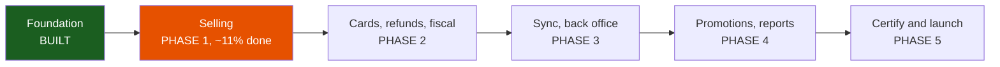

---

## 2. The architecture at a glance

### 2.1 System context

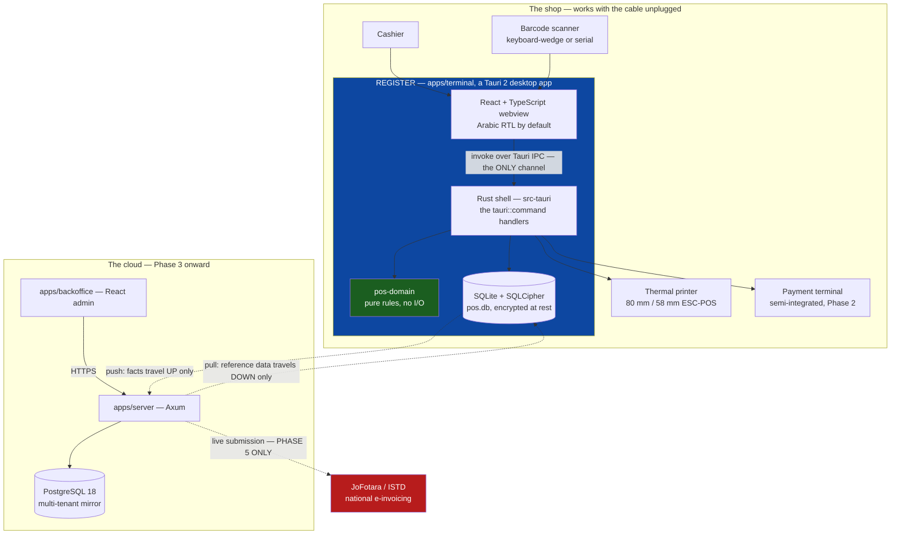

### 2.2 The four boundaries

The whole design is four layers with one-way dependencies. This is a **ports-and-adapters
(hexagonal) architecture**, and the arrows never reverse.

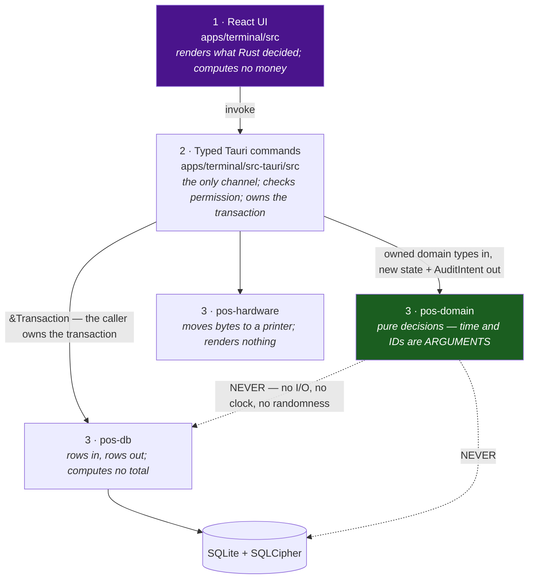

Read that bottom pair of dotted arrows as the crown-jewel rule: `pos-domain` cannot reach storage,
the network, the clock, or a random number generator. It is a **pure function library**, which is
what makes it property-testable and shareable between the register and the server.

The seam rules are [`01-conventions.md`](docs/implementation/01-conventions.md) §3:

- a `pos-db` repository returns **owned domain types**, never a `rusqlite::Row`, never leaks a
  `rusqlite::Error`, and **never computes a total, tax or discount**;
- `pos-domain` takes those types and returns new ones, and **never opens a connection**;
- `apps/terminal/src-tauri` is the only place that orchestrates *read → decide → write*;
- **every write that produces a fact takes an explicit `&Transaction`**, so the caller — never the
  repository — decides where the transaction begins and ends. That is how invariant I-9 stays true.

---

## 3. The nine invariants, and where each is enforced

These are not style preferences. Each one, violated, produces a class of bug that costs money.
They are specified in [`01-conventions.md`](docs/implementation/01-conventions.md) §1 and summarised
in [`CLAUDE.md`](CLAUDE.md).

| # | Invariant | Enforced by |
|---|---|---|
| **I-1** | **Money is `i64` minor units. Always.** No float touches money in Rust, TypeScript, SQL or JSON. Intermediate math uses `rust_decimal`, rounds **once**, returns to `i64`. | `clippy::float_arithmetic = "deny"` workspace-wide ([`Cargo.toml`](Cargo.toml)); `verify-schema.py` refuses `REAL/FLOAT/DOUBLE/NUMERIC/DECIMAL` in any column; `toMinor()` in [`packages/money`](packages/money/src/index.ts) throws on a fraction; `RoundingRule::round_to_i64` is the crate's single rounding point |
| **I-2** | **The minor-unit exponent is per-currency data.** JOD = 3. Never `100`. | `Currency { code: [u8;3], exponent: u8 }`; `Currency`'s `Serialize` is hand-written so only the ISO string crosses the wire and the exponent can never become a second source of truth |
| **I-3** | **Quantities are `i64` milli-units.** `1 unit = 1000`. Weighed and discrete share one representation. | `Qty(i64)` with `Qty::ONE == 1000`; migration `0002` multiplied the shipped `sale_line.qty` by 1000 into `qty_milli`; `verify-schema.py` enforces the `_milli` suffix |
| **I-4** | **Completed sales are immutable.** No `UPDATE` on a complete sale, ever. Corrections are new documents. | **20 SQL triggers** across migrations `0002`/`0003`; `crates/pos-db/tests/sale_immutability.rs` and `fact_table_guards.rs` prove each one refuses with the exact `SQLITE_CONSTRAINT_TRIGGER` code and message |
| **I-5** | **Price and name are copied onto the sale line** at capture time. Reports and refunds read the line, never today's catalogue. | `sale_line` carries `name_snapshot`, `unit_price_minor`, `price_origin`, `qty_step_milli`; trigger `sale_line_quantity_snapshot_*` |
| **I-6** | **Stock is a ledger.** On-hand is `SUM(qty_delta)`, cached in `stock_cache`, and the cache is rebuildable by a command CI runs. | Specified in [`ref/schema.md`](docs/implementation/ref/schema.md) `## 0006`; **not yet shipped** — arrives at microstep 1.10.1 |
| **I-7** | **Ordering comes from owned sequences, never a device clock.** Pull order is the server's `version`; push order is `(register_id, sync_outbox.seq)`. UUIDv7 is identity, not causality. | `sync_outbox.seq INTEGER PRIMARY KEY AUTOINCREMENT`; `repo/outbox.rs` passes `created_at` in as an argument rather than letting the column default `strftime('now')` fire |
| **I-8** | **`pos-domain` is pure.** No I/O, no SQLite, no Tauri, no network, no clock, no randomness. | [`scripts/check-domain-purity.py`](scripts/check-domain-purity.py) audits the resolved *normal* dependency feature graph (`cargo tree -e normal,features`) for UUID-generation and RNG features, **and** lexes every source file to reject clock/RNG/UUID-generation call sites even through aliases and raw identifiers |
| **I-9** | **Every fact graph and its delivery envelope commit in one transaction.** The facts, one `sync_commit`, the complete `fact_commit_member` manifest, and the `sync_outbox` delivery rows. One `BEGIN`, one `COMMIT`. | [`crates/pos-db/src/repo/outbox.rs`](crates/pos-db/src/repo/outbox.rs) — `write_commit` takes the caller's `&Transaction`, never commits, and asks the schema's own `sync_commit_ready` view whether the envelope is whole *before* reporting success |

### 3.1 Two rules refused just as hard

Both are how a price control gets defeated, and both live in
[`01-conventions.md`](docs/implementation/01-conventions.md) §12–§13:

1. **No base sale command accepts a price.** `cart_add_line` is `{ product_id, qty_milli? }` — there
   is no field a price could arrive in. A price-embedded deli label arrives as a typed
   `ScanLookup::PriceEmbedded` whose inner `PriceSource` **cannot be constructed** outside the pure
   domain's scan handler. Price-bearing IPC arguments exist on exactly three controlled commands:
   audited `cart_override_price`, capped and audited `cart_add_department_sale`, and inert
   content-hashed `product_quick_add_prepare`.
2. **Every privileged command consumes a one-use `ApprovalHandle`** in the same transaction as its
   financial effect and its audit row. The handle binds `{ capability, actor, approver, entity_id,
   amount_minor, content_hash, reason, expires_at, nonce }`, `actor != approver` always, and
   `amount_minor = 0` means *exactly zero*, never a wildcard.

---

## 4. Repository map — every directory and what it owns

```
pos/
├── .agents/          Codex-visible skill contracts (mirrors of .claude/skills)
├── .claude/          Claude Code agent policy: hooks, path-scoped rules, skills
├── .codex/           Codex agent policy: config, hooks, execpolicy rules
├── .githooks/        commit-msg · pre-commit · pre-push (installed by `just setup`)
├── .github/          workflows, issue forms, PR templates, Dependabot, labeler
├── apps/
│   ├── backoffice/   React admin SPA (scaffold; real work is Phase 3)
│   ├── server/       Axum cloud service + the Postgres migration mirror
│   └── terminal/     THE REGISTER — Tauri 2: src/ = React, src-tauri/ = Rust
├── benchmarks/       reference-register.toml + baselines/ (both deliberately blank)
├── crates/
│   ├── pos-db/       SQLite schema, migrations, encryption, repositories
│   ├── pos-domain/   THE CROWN JEWEL — pure rules: Money, Qty, ids, time, catalog
│   ├── pos-hardware/ printer/scanner/terminal traits + a simulator
│   ├── pos-sync/     outbox/cursor protocol types (a pre-protocol stub today)
│   └── pos-test-support/  shared proptest configuration (dev-dependency ONLY)
├── docs/
│   ├── implementation/  THE PLAN OF RECORD — what to type, in what order
│   ├── plan/            IMMUTABLE source plans — read for intent, never for a name
│   └── orientation.md   the control-surface map
├── infra/            docker-compose.yml — the development Postgres
├── packages/
│   ├── api-types/    shared request/response DTOs (scaffold)
│   ├── money/        the minor-unit rule for both front ends
│   └── ui/           shared React components (scaffold)
├── scripts/          ~16,600 lines of policy, verification and GitHub automation
└── justfile          the command surface — every command in the repo
```

### 4.1 Directory-by-directory

#### `crates/pos-domain/` — the crown jewel

**Role.** All business rules that do not need the outside world. **Why it exists separately:**
purity is what makes it property-testable at 4,096 cases per property *and* shareable with the
server, so the register and the cloud can never disagree about what a total is.

**What is in it today** (four modules, alphabetical, no cross-module edges):

| Module | Ships | Contents |
|---|---|---|
| [`money.rs`](crates/pos-domain/src/money.rs) | 1.1.1–1.1.6 | `Currency`, `Money`, `Qty`, `Percent`, `RoundingRule`, `RoundingDirection`, `MoneyError` |
| [`ids.rs`](crates/pos-domain/src/ids.rs) | 1.1.8 | fifteen typed UUID newtypes + the `IdSource` port and `SeqIdSource` |
| [`time.rs`](crates/pos-domain/src/time.rs) | 1.1.9 (pure half) | `Timestamp`, `BusinessDate`, `DayBoundary`, `Clock`/`FixedClock`, `MonotonicClock`, `ClockState`, `ClockConfidence`, `ClockPolicy`, `effective_now`, `business_date_of` |
| [`catalog.rs`](crates/pos-domain/src/catalog.rs) | 1.2.2 | `Product`, `UnitOfMeasure`, `Barcode`, `BarcodeKind`, `RegulatedSaleForm`, `SaleForm`, `RegulatedKind`, `CatalogError` |

**Commands.** `cargo nextest run -p pos-domain` · `cargo nextest run -p pos-domain -E 'test(prop_)'` ·
`just acyclic` · `just domain-purity` · `just prop-names`

#### `crates/pos-db/` — the encrypted local store

**Role.** Connection setup, SQLCipher key handling, the forward-only migration runner, and (as of
microstep 1.8.9) the first repository. **Why it exists separately:** it is the only crate that knows
SQL, so a rule about money can never be smuggled into a query.

Public surface today is deliberately tiny:

```rust
pos_db::open(path: &Path, key: &str) -> Result<Connection, DbError>
pos_db::SCHEMA_VERSION: i64                 // == MIGRATIONS.len(), 3 today
pos_db::DbError                             // a dozen named variants
pos_db::key::{get_or_create, get_or_create_with_source, honours_env_key, KeySource}
pos_db::repo::outbox::{OutboxRepository, CommitEnvelope, FactMember, CommitReceipt, ManifestEntry}
```

**Commands.** `cargo nextest run -p pos-db` · `cargo nextest run -p pos-db outbox::` ·
`just verify-schema` · `just db-local-reset`

#### `crates/pos-sync/` — the sync protocol types

**Role.** Wire types shared by the register's push/pull client and the server. **Status:** a 27-line
**pre-protocol stub** that no crate depends on. Its `PushBatch` carries `device_id` in the body,
has no commit grouping, no `protocol_version`, and no `payload_hash` — all three of which the
current protocol reference requires. Treat it as a placeholder to delete when Phase 3 starts, not a
contract to extend.

#### `crates/pos-hardware/` — printers and the simulator

**Role.** Traits (`ReceiptPrinter`, later `BarcodeSource`, `PaymentTerminal`) plus `SimulatedPrinter`,
the in-memory printer that CI and laptop development run against. It captures every print and drawer
kick and can be forced into `PaperOut`/`CoverOpen`/`Offline`.

Note the poison-recovering `lock()` helper — enabling the panic lints on day one found **three real
`unwrap()` calls on `Mutex::lock()`** in this file, in production code.

**Commands.** `cargo nextest run -p pos-hardware` · add `-- --nocapture` to see the byte stream

#### `crates/pos-test-support/` — the shared property harness

**Role.** Decides the proptest case count **once**, so no property can pick a number that makes
itself convenient. `domain_proptest_config()` = **4,096** cases; `io_proptest_config()` = **256**.
`PROPTEST_CASES` is applied as a **raising** override only — an invalid value, or one below the crate
default, is refused.

**Why it is a `[dev-dependencies]` entry and nothing else:** it reads the process environment, which
no crate that ships to a register may do. The dependency table *is* the boundary.

#### `apps/terminal/` — the register

**Role.** The thing a cashier touches. `src/` is React + TypeScript; `src-tauri/` is the Rust shell
and the entire IPC boundary. See [§7.1](#71-the-register--appsterminal).

**Commands.** `just dev-terminal` · `pnpm --filter terminal tauri build` · `pnpm --filter terminal test`

#### `apps/server/` — the cloud service

**Role.** Axum service for sync, auth and reporting, plus **the Postgres migration mirror**. Today it
serves exactly two routes. See [§7.2](#72-the-server--appsserver).

**Commands.** `just dev-server` · `just db-up` · `just migrate` · `just verify-pg`

#### `apps/backoffice/` — the admin SPA

**Role.** Catalogue, pricing and reports for the merchant's office machine. Today it renders one
`<h1>` announcing that those arrive in Phase 3. It already has the Vitest + jsdom component-test
pattern the terminal still lacks.

**Commands.** `just dev-backoffice` · `pnpm --filter backoffice build && pnpm --filter backoffice preview`

#### `packages/` — shared TypeScript

| Package | Status | Role |
|---|---|---|
| [`packages/money`](packages/money/src/index.ts) | **real** | The minor-unit rule for both front ends. `toMinor()` throws `MoneyError` on a fraction — the TypeScript side of I-1. All arithmetic is `bigint`. `formatMinor(334, JOD) === "0.334"` |
| [`packages/ui`](packages/ui/) | scaffold | Shared React components |
| [`packages/api-types`](packages/api-types/) | scaffold | Shared DTOs. Will be **generated from Rust by `ts-rs`**, never hand-written |

#### `docs/plan/` — immutable historical inputs

**Role.** The two source plans (business/functional and engineering blueprint) plus the original
Phase-0 setup guide. **They are frozen on purpose and are never edited.**

⚠️ **This is the single most dangerous directory in the repository for a newcomer.** It reads as
current truth and much of it is superseded. Before acting on any sentence from it, read
[`00-master-plan.md`](docs/implementation/00-master-plan.md) **§4a, "Errata and concordance"** — the
ledger of every superseded name. A partial list of things that read as current and are wrong:
`rate_bp` (now `rate_ppm`), banker's rounding as the money default (now `HalfAwayFromZero` as one
versioned jurisdiction policy), `stock_movement` (now `stock_ledger` + `stock_cache`), `tax_group`
(now `tax_category` + `tax_rate`), `product_barcode` (now `barcode`), `user` (now `app_user`),
`role_perm` (now `role_capability`), a mutable `loyalty_points` column (now `loyalty_ledger`),
migrations with `down` steps (now forward-only), and a Phase-3 fiscal production cutover (now
Phase 5). §4a has 43 such rows.

#### `docs/implementation/` — the plan of record

**Role.** What to type, in what order, and how you know it worked. See
[§14](#14-the-plan-of-record--phases-and-the-current-frontier).

#### `scripts/` — the enforcement layer

**Role.** ~16,600 lines of Python, Bash and Ruby that decide whether a migration may be edited,
whether a secret may be committed, whether a PR may weaken the trusted-workflow boundary, and whether
the documented schema is actually executable. Nothing here is style linting. See
[§13](#13-the-safety-layers-and-their-honest-limits).

#### `.claude/`, `.codex/`, `.agents/`, `.githooks/`, `.github/`

The safety and delivery machinery. See [§13](#13-the-safety-layers-and-their-honest-limits) and
[§11](#11-the-delivery-cycle--branches-prs-and-ci).

#### `benchmarks/`

`reference-register.toml` with **every identity field deliberately blank**, and `baselines/` holding
only a README. No reference register has been bought, so `just bench-gate` **refuses every run**.
That is conventions §7.1 working, not failing.

---

## 5. How the parts communicate

### 5.1 The one channel: Tauri IPC

There is exactly one way for the React UI to reach the core: a **typed Tauri command**. No `fs`,
`shell`, `http`, `dialog`, `opener` or `updater` plugin is exposed to the webview.

Today the entire IPC surface is **one command**, in
[`apps/terminal/src-tauri/src/lib.rs`](apps/terminal/src-tauri/src/lib.rs):

```rust
#[tauri::command]
fn split_tender(total_minor: i64, parts: u32) -> Result<Vec<i64>, String> {
    pos_domain::Money::from_minor(total_minor, pos_domain::Currency::JOD)
        .split_evenly(parts)
        .map(|v| v.into_iter().map(|m| m.minor()).collect())
        .map_err(|e| e.to_string())
}
```

and exactly one call site, in [`apps/terminal/src/App.tsx`](apps/terminal/src/App.tsx):

```ts
const result = await invoke<number[]>("split_tender", { totalMinor, parts });
```

Note the mapping: **camelCase in TypeScript, `snake_case` in Rust.** Tauri v2 translates.

### 5.2 The round trip that exists today

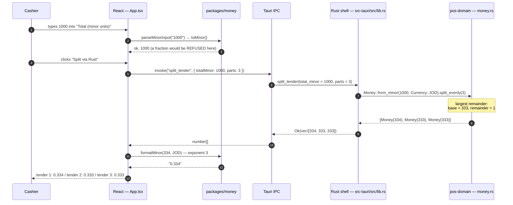

### 5.3 The round trip the product will have

Every command follows the same nine steps — this is the shape you will implement over and over
([`ref/ipc-contract.md`](docs/implementation/ref/ipc-contract.md) §9):

```mermaid
sequenceDiagram
    autonumber
    participant UI as React
    participant H as Tauri command handler
    participant P as permissions
    participant DB as pos-db repository
    participant DOM as pos-domain
    participant SQL as SQLite

    UI->>H: invoke("cart_override_price", { line_id, unit_price_minor, reason, approval_id })
    H->>P: resolve the session actor, construct Authorized&lt;PriceOverride&gt; IN RUST
    Note over P: hiding a button is UX — the check is here
    H->>DB: resolve approval_id → ApprovalHandle
    H->>H: check entity_id, amount_minor, content_hash, reason, expiry, one-use nonce
    H->>DB: load the cart and the line
    DB-->>H: owned domain types — never a rusqlite::Row
    H->>DOM: override_price(cart, line, to, reason, &authorized)
    DOM-->>H: (NewCart, AuditIntent) — no I/O happened
    H->>SQL: BEGIN
    H->>SQL: write the effect + the audit row + approval_consumption
    H->>SQL: write sync_commit + fact_commit_member manifest + sync_outbox rows
    H->>SQL: COMMIT
    H-->>UI: CartSnapshot (fully priced) + emit cart://changed
```

Two things to notice, because they are the whole security model:

- The UI **never computes money.** `CartSnapshot` is the *priced* cart — lines, discounts, tax
  summary, totals. If a number is not in the snapshot, you add it to the snapshot; you do not compute
  it in TypeScript.
- The approval, the effect and the audit row commit **together or not at all**. A restart cannot
  replay an approval for a different sale, a larger amount, or altered prepared content.

### 5.4 Events — Rust to UI

Long operations return a handle immediately and report progress through events, because *"a cashier
watching a spinner with no state is a cashier who presses the button again"*:

| Event | When |
|---|---|
| `cart://changed` | any cart mutation — the UI re-renders, never patches locally |
| `card://progress` | `WaitingForCard` → `Processing` → **`CheckingLastTransaction`** → result |
| `card://result` | authorisation resolves |
| `print://failed`, `printer://status` | print failure after finalize; paper warnings at pay time |
| `fiscal://changed`, `sync://changed`, `shift://changed` | queue depth, connectivity, shift state |
| `sale://recovered` | startup found an in-flight sale to resume |
| `clock://changed`, `alarm://raised` | clock trust moved; disk full / audit-chain break / dead letter |

None of these are emitted yet — there is no `emit`, `listen`, or `@tauri-apps/api/event` import in the
tree.

### 5.5 Register ↔ cloud

Four ownership classes, and the direction is the design:

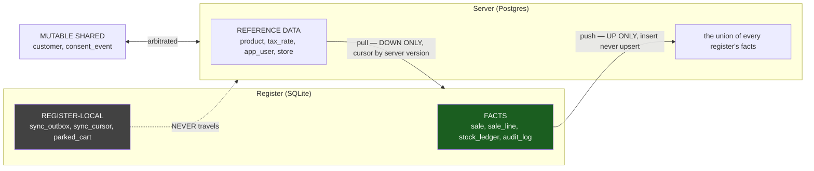

The unit of delivery is **not a row** — it is a **commit group**. One business transaction produces
one `sync_commit`, a complete `fact_commit_member` manifest, and one `sync_outbox` delivery row per
member. The server applies a group **whole or not at all**, so it can never accept a sale header
without its lines.

**Status:** the local write half exists (microstep 1.8.9). *Everything that moves data* — the pusher,
the puller, the HTTP endpoints, the server apply, the retry/lease state machine, pruning, protocol
negotiation, the chaos harness — is Phase 3 and is entirely unbuilt.

---

## 6. The Rust crates in detail

### 6.1 `pos-domain` — money, quantity, rate

`Money` is `{ minor: i64, currency: Currency }` and is `Copy`. Note what it **deliberately does not
derive**: `PartialOrd`/`Ord` are absent, so `<`, `>`, `min`, `max` and `.sort()` on `Money` are
**compile errors**. Ordering goes through `checked_cmp(self, other) -> Result<Ordering, MoneyError>`,
which can refuse a currency mismatch instead of silently comparing dinars to dollars.

Selected API:

```rust
Money::from_minor(i64, Currency) -> Money        // const
Money::zero(Currency) -> Money
Money::minor(self) -> i64                        // const
Money::checked_add / checked_sub / checked_neg   -> Result<Money, MoneyError>
Money::sum<I: IntoIterator<Item = Money>>(iter, currency) -> Result<Money, MoneyError>
Money::checked_cmp(self, Money)                  -> Result<Ordering, MoneyError>
Money::mul_qty(self, Qty, RoundingRule)          -> Result<Money, MoneyError>
Money::mul_percent(self, Percent, RoundingRule)  -> Result<Money, MoneyError>
Money::split_evenly(self, parts: u32)            -> Result<Vec<Money>, MoneyError>
Money::split_proportional(self, weights: &[Money])-> Result<Vec<Money>, MoneyError>
Money::split_proportional_by(self, weights: &[i64]) -> Result<Vec<Money>, MoneyError>
Money::round_to_step(self, step_minor: i64, RoundingDirection) -> Result<Money, MoneyError>
Money::to_decimal / from_decimal / format / format_exact / parse
```

Three things worth internalising:

1. **`split_evenly` is largest-remainder.** `base = minor / parts`, and the first `remainder` pieces
   get `+1`. 1000 fils into 3 is `[334, 333, 333]` — the sum is exactly the input, always.
2. **`split_proportional` is the proration tool, not `split_evenly`.** Equal splitting is not
   proportional-by-line-value allocation; a superseded correction confused the two.
3. **`RoundingRule::round_to_i64` is the *only* place a `Decimal` becomes an `i64`.** "Rounds once"
   needs exactly one implementation. The default is `HalfAwayFromZero` — a **jurisdiction** default,
   deliberately not a Rust `Default` impl, because a cashier or a store setting must never be able to
   select `HalfEven` and make two registers compute different tax.

`Qty(i64)` is milli-units: `Qty::ONE == 1000`, `Qty::from_milli(347).format(true) == "0.347"`.
`Percent(i64)` is parts-per-million: 16% is `160_000`. Basis points were rejected because Jordanian
reduced rates include 1% and 2% and future decrees are not guaranteed to land on whole basis points.

#### Typed IDs, and the test that proves they work

Fifteen UUID newtypes generated by a `typed_id!` macro — `SaleId`, `SaleLineId`, `ProductId`,
`StoreId`, `RegisterId`, `UserId`, `ShiftId`, `TenderId`, `ApprovalId`, `CustomerId`, `CategoryId`,
`OrgId`, `PromotionId`, `StockEventId`, `TaxCategoryId`.

The point of a typed ID is that `f(line_id, sale_id)` should not compile. **An ordinary `#[test]`
cannot express that**, so the proof is a `trybuild` compile-fail test:
[`crates/pos-domain/tests/typed_ids_ui.rs`](crates/pos-domain/tests/typed_ids_ui.rs) compiles
[`tests/ui/typed_ids_do_not_interconvert.rs`](crates/pos-domain/tests/ui/typed_ids_do_not_interconvert.rs)
and byte-compares the compiler's error output against a committed `.stderr` golden. The golden is
coupled to the pinned compiler; regenerate with
`TRYBUILD=overwrite cargo test -p pos-domain --test typed_ids_ui`.

The crate **cannot mint a UUID** — purity forbids the `uuid` version features — so IDs arrive as
arguments or from the injected `IdSource` port. `SeqIdSource` is a deterministic, counter-driven,
v7-*shaped* generator built by composing bytes by hand and handing them to `Uuid::from_u128`.

#### How purity is actually enforced

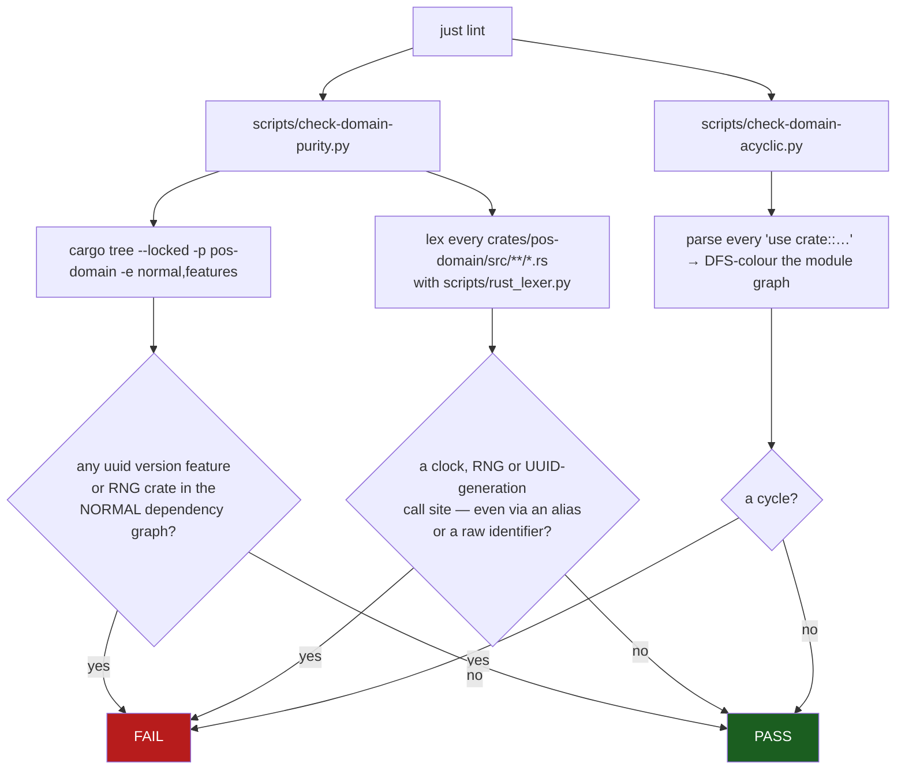

The acyclicity checker is custom for a documented reason: `cargo modules dependencies --acyclic`
builds an **item-level** graph, so any constructor returning `Self` — `Money::from_minor -> Money` —
is reported as a cycle, and the filter flags do not help because cycle detection runs before them.

### 6.2 `pos-db` — the encrypted store

#### Opening a database

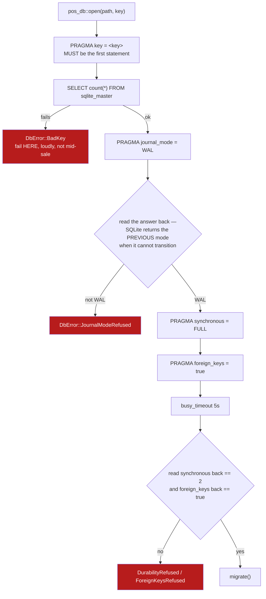

Every pragma is **read back** because a pragma is advisory — an unknown value leaves the old one
silently in place. Reading it back turns *"someone changed it for a throughput run"* into a failed
open. The stake for `synchronous = FULL` is spelled out in the source: losing the commit loses the
sale, its stock event, its outbox row and its fiscal-queue row *cleanly and invisibly* — no half-state
to detect, no alarm to raise, and a drawer that is over at Z time with no document to explain it.

#### The migration runner

```rust
const MIGRATIONS: &[&str] = &[
    include_str!("../migrations/0001_init.sql"),
    include_str!("../migrations/0002_sale_integrity.sql"),
    include_str!("../migrations/0003_strict_rebuild_and_catalog_depth.sql"),
];
pub const SCHEMA_VERSION: i64 = MIGRATIONS.len() as i64;   // 3
```

The SQL is **compiled into the binary** — there is no runtime filesystem read, so a register cannot be
pointed at a different migration set. Then:

- read `PRAGMA user_version`; `usize::try_from` (not `as usize`, which would wrap `-1` to a huge
  number and silently skip every migration) → `SchemaVersionInvalid`;
- `applied > supported` → **`SchemaTooNew`**. This is why "install the old binary" is not a rollback:
  the older binary *correctly refuses*;
- for each unapplied file: **one transaction per file**, `execute_batch(sql)`, then
  `PRAGMA user_version = idx + 1` **inside the same transaction**, then commit.

A crash mid-file therefore leaves the counter unchanged and the file re-runs whole. `verify-schema.py`
reproduces this exact sequence rather than approximating it.

#### The key

`SERVICE = "pos-terminal"`, `USER = "sqlcipher-db-key"` in the OS credential store (macOS Keychain,
Windows Credential Manager, Linux Secret Service). Order of operations:

1. if `honours_env_key()` **and** `POS_DB_KEY` is set and non-empty → use it, source `Environment`;
2. else read the credential store;
3. on `NoEntry` → generate 32 bytes from `getrandom::fill` → 64 lowercase hex → store it;
4. any other keyring error → `DbError::Keyring`.

`honours_env_key()` is `env_key_permitted(cfg!(debug_assertions))`, and `env_key_permitted` is a
`const fn` of the build profile. That is deliberate: it lets a *debug* test assert what a *release*
build does (`a_release_build_refuses_the_environment_key`) — a `#[cfg]` block could not be tested that
way. And the release behaviour is **ignore and continue**, never an error: a stray inherited variable
must neither supply the production key nor stop a register opening its till.

---

## 7. The applications in detail

### 7.1 The register — `apps/terminal/`

#### Boot sequence

```mermaid
sequenceDiagram
    autonumber
    participant J as just dev-terminal
    participant T as Tauri CLI
    participant V as Vite
    participant C as cargo
    participant W as Window

    J->>T: pnpm --filter terminal tauri dev
    T->>T: read src-tauri/tauri.conf.json
    T->>V: run beforeDevCommand = "pnpm dev"
    V->>V: bind port 1420 with strictPort:true
    Note over V: strictPort matters — devUrl is the literal<br/>"http://localhost:1420"; a moved port is a blank window
    T->>C: build the `terminal` crate
    C->>C: build.rs → tauri_build::build()<br/>regenerates src-tauri/gen/schemas/*.json
    C->>W: terminal_lib::run() → tauri::Builder<br/>.invoke_handler(generate_handler![split_tender])
    W-->>J: 1366x768 window titled "POS Terminal"
```

#### What you see on screen, exactly

| Property | Value | Source |
|---|---|---|
| Window title / product name | `POS Terminal` | `tauri.conf.json` |
| Bundle identifier | `com.perfectcoders.pos` | `tauri.conf.json` — also the name of the local data directory |
| Size | 1366 × 768, minimum 1024 × 640 | the minimum is the RTL-pass resize target (edge case E.60) |
| Dev URL | `http://localhost:1420` | pinned, `strictPort: true` |

The page, top to bottom. Because the document ships `lang="ar" dir="rtl"`, **every flex row is
mirrored** — the heading sits on the right and the language button on the left:

1. **`POS Terminal — Phase 0 smoke panel`** and a bordered button reading **English** (the label for
   the language you would switch *to*, written in that language).
2. A monospace debug line: **`lang=ar dir=rtl`**. This is literally the line the manual RTL checklist
   tells you to read before touching anything.
3. Two number inputs — `Total (minor units)` defaulting to **1000**, and `Split into` defaulting to
   **3** — and a green **Split via Rust** button.
4. A refusal line (amber, `role="alert"`) when the money guard rejects what you typed.
5. The result list once you press the button.

Press **Split via Rust** with the defaults and you get:

```
tender 1: 0.334
tender 2: 0.333
tender 3: 0.333
```

Press the language toggle and the whole layout mirrors to LTR, the debug line becomes `lang=en dir=ltr`,
and the button becomes **العربية**. Nothing else changes — there is no string catalogue yet.

#### RTL, mechanically

Three files and a strict layering:

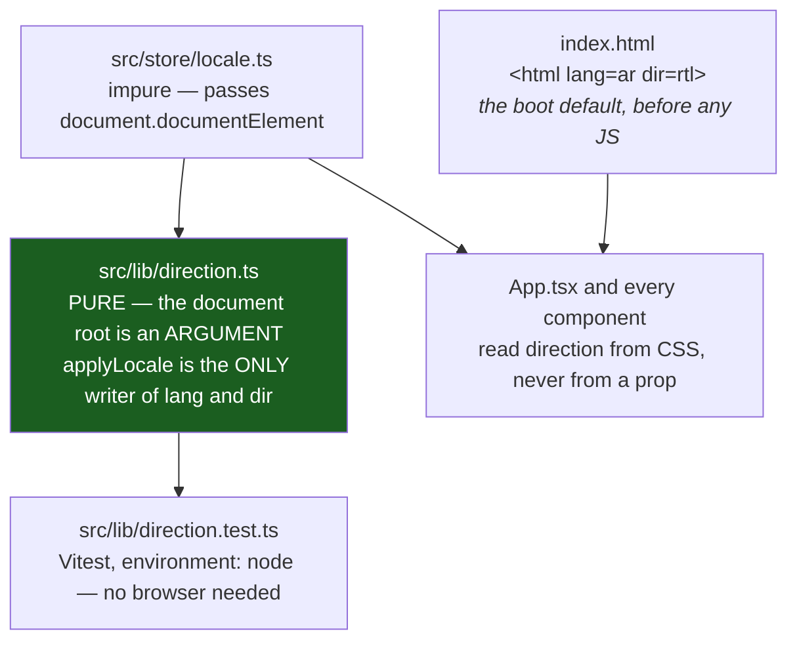

`direction.ts` takes the root as an argument instead of reaching for `document` — the same discipline
`pos-domain` applies to clocks and IDs, and it is why the six locale rules are testable without a
browser.

The enforcement is [`scripts/check-logical-css.sh`](scripts/check-logical-css.sh), run by `just lint`.
It refuses physical CSS sides — `pl-4`, `left-0`, `text-left`, `border-l`, `rounded-r`, `float-left`,
`margin-left`, bare `left:` — because Biome's recommended preset knows nothing about Tailwind
utilities or CSS sides, and a physical side is a layout bug in Arabic that reviewing the English build
cannot catch. The escape hatch is a `physical-ok: <reason>` comment on the line.

#### Security posture of the shell

The CSP, verbatim from `tauri.conf.json`:

```
default-src 'self'; img-src 'self' data: blob:; style-src 'self' 'unsafe-inline'; font-src 'self' data:; connect-src 'self' ipc: http://ipc.localhost
```

`connect-src` lists only the IPC transports — **there is no remote origin**, so `fetch()` to anything
outside the app is refused. If something cannot reach the core through a command, that is the design
working.

`capabilities/default.json` grants the `main` window exactly one entry: `core:default`. There is no
`tauri-plugin-*` dependency at all, so no `fs:`, `shell:`, `http:`, `dialog:`, `opener:` or `updater:`
permission exists. Be precise about what `core:default` *does* grant, though — roughly 90 core
commands including `core:event:allow-emit`, `core:webview:allow-internal-toggle-devtools` and
`core:image:allow-from-path`. "Deny-by-default" is true for plugins, not for the core set.

#### The unwired time module

[`apps/terminal/src-tauri/src/time.rs`](apps/terminal/src-tauri/src/time.rs) is complete, documented
and covered by four tests — and **nothing calls it**. It resolves an IANA zone id plus an instant to
integer offset minutes so the pure domain never sees a time-zone rule:

- it uses `jiff::tz::TimeZoneDatabase::bundled()` **deliberately**, not jiff's global database, which
  prefers the host database on Unix and would make two register operating systems resolve against
  different tzdata releases;
- it rejects jiff's `Etc/Unknown` fallback explicitly, so corrupted settings cannot silently become
  offset 0;
- it refuses a non-whole-minute offset (Europe/Paris in 1900 was 561 seconds).

### 7.2 The server — `apps/server/`

66 lines of Axum today:

| Route | Returns |
|---|---|
| `GET /health` | `{"status":"ok","service":"pos-server","version":"0.1.0"}` |
| `GET /health/db` | `{"db":"ok"}` (200) · `{"db":"unconfigured"}` (503) · `{"db":"error", ...}` (503) |

Bound to **`127.0.0.1:8080`**. The pool is built with `connect_lazy`, and `DATABASE_URL` is optional at
startup, so the process boots without Compose running and `/health/db` simply reports `unconfigured`.

`dotenvy::dotenv()` loads `apps/server/.env` if present — **absent in production, where the environment
supplies `DATABASE_URL` directly, and never an error either way.** Note dotenvy does *not* override an
already-exported variable; that is exactly why `just db-reset` pins `DATABASE_URL` to the literal
Compose URL rather than trusting the shell (a shell pointed at staging would otherwise migrate
staging, one line after `down -v`).

### 7.3 The JS/TS toolchain

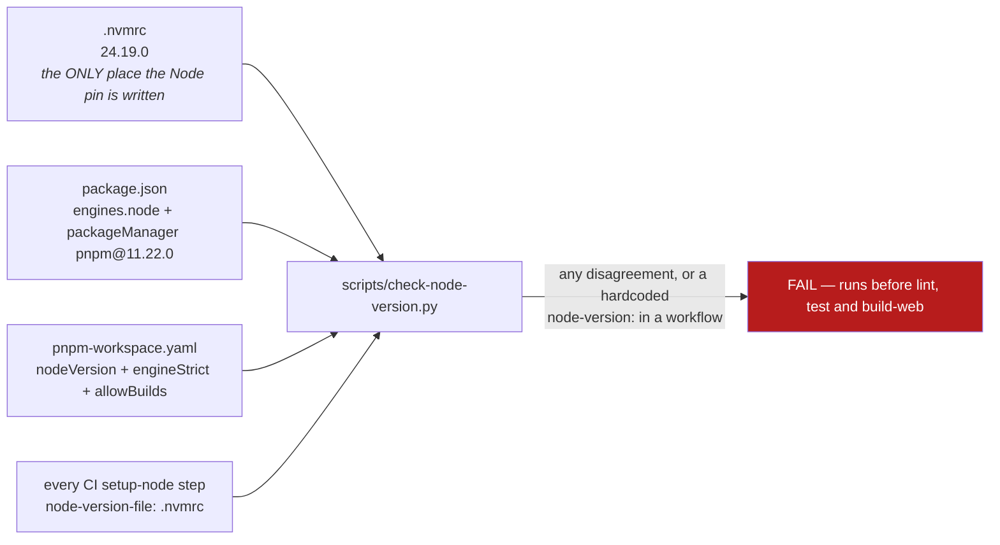

Two `pnpm-workspace.yaml` details that bite:

- **`allowBuilds`** is pnpm 11's spelling. Anything not named there has its post-install script
  silently skipped and a fresh install then fails with `ERR_PNPM_IGNORED_BUILDS`. `esbuild` (fetches
  the platform binary Vite needs) and `@tailwindcss/oxide` (Tailwind v4's native scanner) are both
  required.
- **`engineStrict: true` + `nodeVersion: 24.19.0`** means dependency engines resolve against the pinned
  release even if a newer system Node launched the install.

---

## 8. The data layer

### 8.1 The shipped schema

Three migrations exist on disk and in the `MIGRATIONS` array. After the chain: **21 tables, 2 views,
13 indexes, 54 triggers.**

| Migration | `user_version` | What it does |
|---|---|---|
| `0001_init.sql` | 0 → 1 | The Phase-0 subset: `product`, `sale`, `sale_line`, `sale_tender`, `sync_outbox`, `sync_cursor`. All non-STRICT |
| `0002_sale_integrity.sql` | 1 → 2 | The qty fix (`qty` → `qty_milli`, ×1000) plus **eight I-4 immutability triggers**, per-register receipt-number uniqueness, two FK indexes — all in one file, because a rebuild silently takes its triggers and indexes with it |
| `0003_strict_rebuild_and_catalog_depth.sql` | 2 → 3 | 1,118 lines. Rebuilds the six loose tables as **STRICT**, adds 15 new tables including the sync envelope and the whole tax taxonomy, and lands 57 `CREATE TRIGGER` statements |

#### The shipped tables

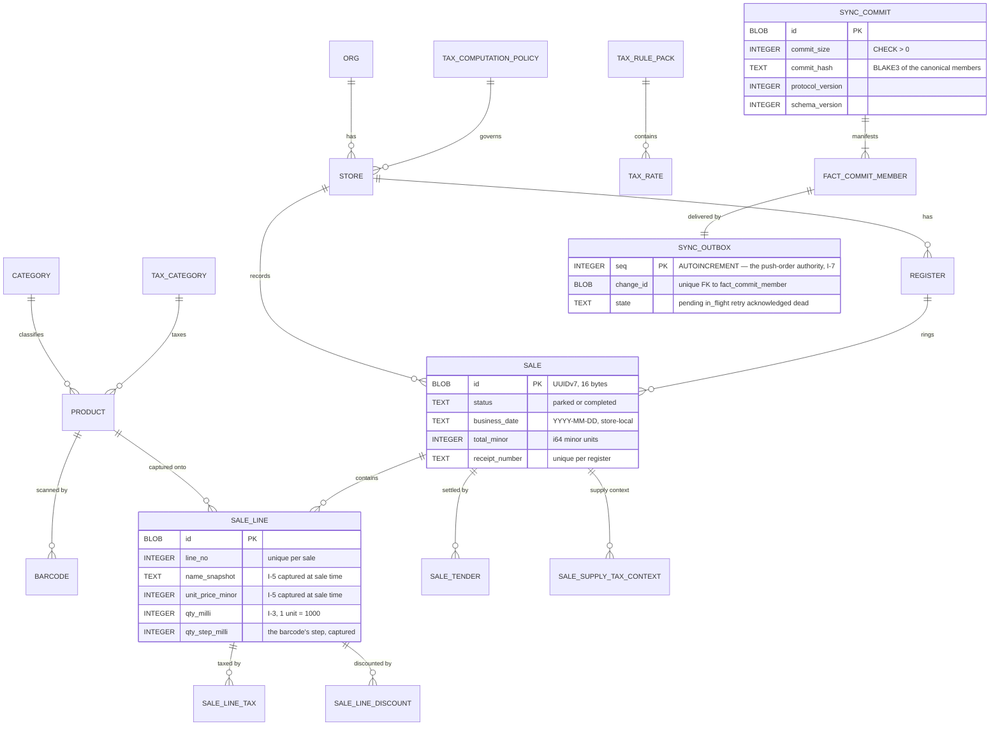

#### Why `STRICT`, and what it bought

SQLite's default is that a declared type is a *suggestion*: `INTEGER NOT NULL` happily accepts
`'ten point five'`, and a `REAL` lands in a `*_minor` column — **invariant I-1 defeated by the storage
engine rather than by anyone's mistake**. `STRICT` also makes every primary-key column implicitly
`NOT NULL`, composite keys included, which closed the NULL-identity hole for ~40 id columns for free
instead of a 57-table `NOT NULL` sweep.

It broke exactly one intentional NULL — `user_role.store_id`, where NULL means an org-wide grant —
and `crates/pos-db/tests/authorization_scope.rs` is the five-test pin for both halves of the fix.

#### The rebuild recipe, and why it is unusual

SQLite documents a twelve-step table-rebuild procedure. **It cannot be used here**, and the migration
says why: that procedure begins by turning foreign keys off, and `PRAGMA foreign_keys` is a **no-op
inside a transaction** — and the runner wraps every file in one. `PRAGMA defer_foreign_keys` is not a
substitute either, because `DROP TABLE` records a deferred violation that recreating the parent does
not clear, so the `COMMIT` fails. Verified both ways.

So `0003` uses constraint-free **staging tables** instead:

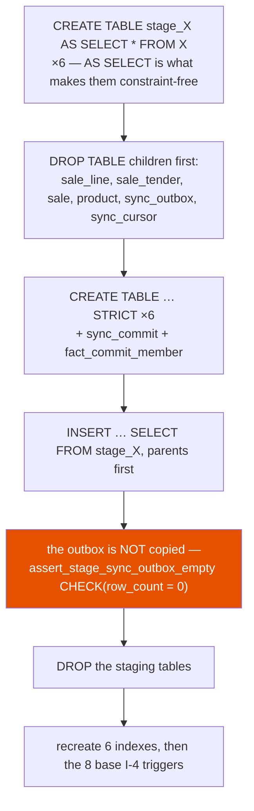

That refusal in the middle is worth understanding: a pre-protocol transport row has no deterministic
canonical envelope, so *inventing random ids or sentinel hashes would turn a migration placeholder
into apparently valid financial evidence*. A non-empty legacy queue **aborts the whole migration**.

#### The bug the rebuild fixed

Two of the restored triggers were **corrected, not copied**. `0002`'s `sale_line` and `sale_tender`
guards tested the **OLD** parent only. That refused an edit to a row already on a completed sale — and
**permitted the inbound move**: take a row belonging to a *parked* sale and re-point its `sale_id` at
a completed one. The closed document grows a line, and not one protected row was edited. It was
reproduced against the shipped chain: a completed sale went from one line to two.

The fix checks both parents, and the regression test is
`no_sale_fact_can_be_reparented_into_a_completed_sale`.

### 8.2 The sync envelope — invariant I-9 in DDL

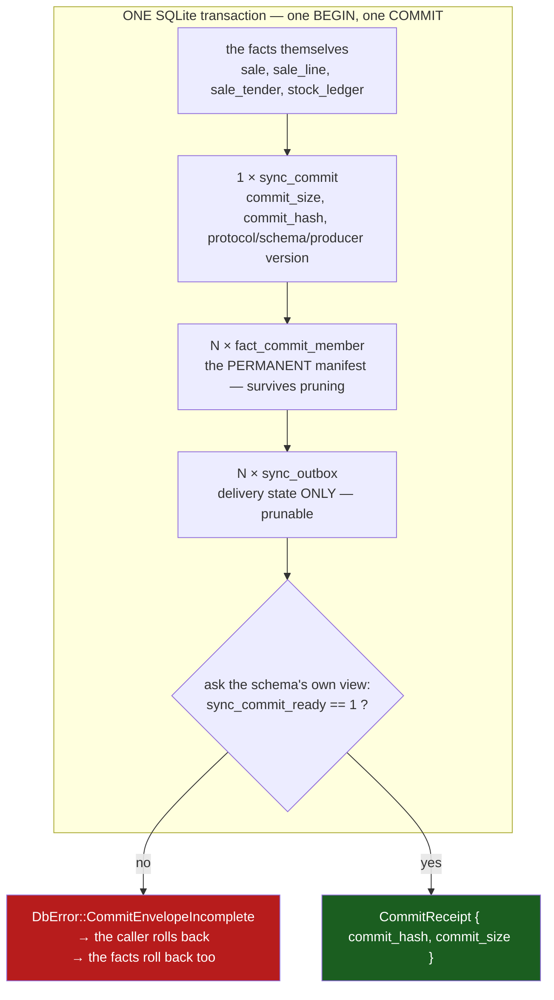

Three tables with three different lifetimes, and that separation is the design:

- **`sync_commit`** — one durable envelope per business transaction. Versions and cardinality live
  *once*, on the parent, so member rows cannot disagree about them.
- **`fact_commit_member`** — permanent membership. `op TEXT CHECK (op = 'insert')`: facts are inserted,
  never upserted, because an upsert overwrites an immutable sale — I-4 broken by the transport.
  `UNIQUE (commit_id, commit_index)` and `UNIQUE (entity, entity_id)`. Triggers refuse every `UPDATE`
  and `DELETE` unconditionally.
- **`sync_outbox`** — delivery state only, with four **biconditional** CHECKs that make the state
  machine total:

```sql
CHECK ((state = 'acknowledged') = (acknowledged_at IS NOT NULL))
CHECK ((state = 'in_flight')    = (claimed_at       IS NOT NULL))
CHECK ((state = 'in_flight')    = (lease_owner      IS NOT NULL))
CHECK ((state = 'in_flight')    = (lease_expires_at IS NOT NULL))
```

The intended delivery lifecycle (schema and index exist; **no code drives it yet**):

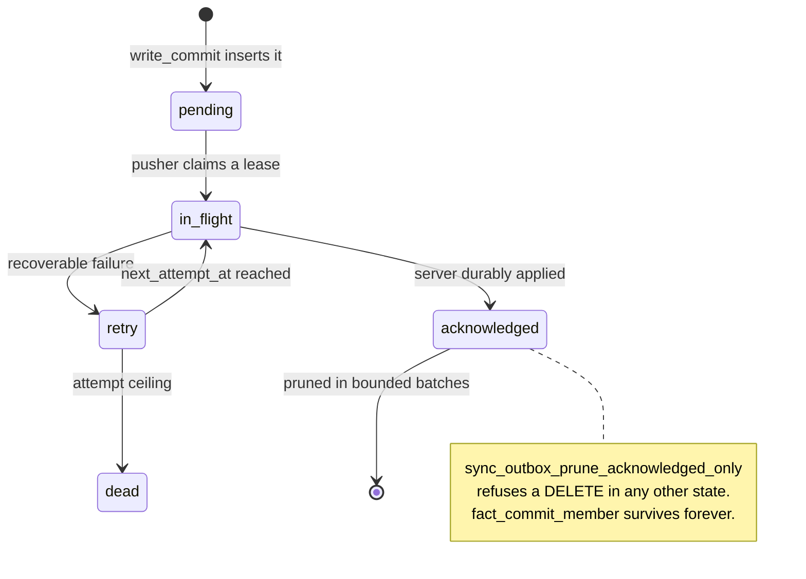

The commit hash is BLAKE3 over a **versioned, domain-separated** byte layout — a version byte, the
literal separator `pos-sync-commit\0`, `commit_size`, then per member (in `commit_index` order) the
index, length-prefixed `change_id`/`entity`/`entity_id`/`op`, and the BLAKE3 of the payload.
Header fields are **deliberately excluded**: binding `created_at` or `producer_version` would make two
registers producing the same fact graph disagree.

### 8.3 The Postgres mirror, and how it is verified

The mirror **cannot share the SQLite numbers** — sqlx names files with a unique 14-digit UTC timestamp
and a lower-snake name. So each mirror **declares** its counterpart in a header comment:

```sql
-- Mirrors SQLite 0002_sale_integrity.sql
```

or `-- Server-only: <why>`. [`scripts/verify-pg-migrations.py`](scripts/verify-pg-migrations.py) checks
the declaration **both ways** — every SQLite migration has a mirror or a `REGISTER_LOCAL` entry, and
every mirror names a real SQLite migration.

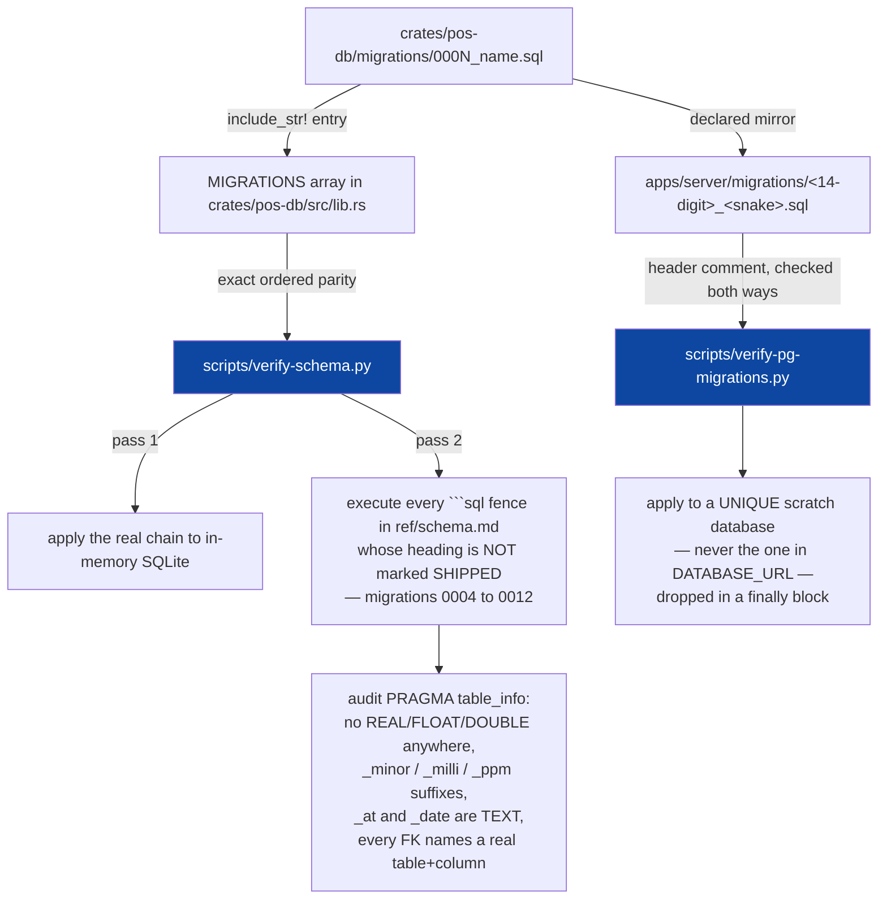

**That second pass is the clever part.** Migrations `0004`–`0012` do not exist as files — they exist
only as fenced SQL inside [`ref/schema.md`](docs/implementation/ref/schema.md). But `verify-schema.py`
*executes them for real* against SQLite on every `just lint`. So the future schema is syntax-proven,
FK-proven and convention-proven long before it ships. Its failure message is the right instinct:
*"ref/schema.md is the plan of record — fix the doc, or the migration that drifted from it."*

Run it yourself and read the two lines it prints — they are the honest measure of shipped versus
planned:

```
$ python3 ./scripts/verify-schema.py
shipped: 3 migration(s), 21 tables, 225 columns
schema:  13 SQL blocks applied, 138 tables, 1231 columns, 53 indexes, 274 foreign keys
schema reference is executable and conforms to conventions §2
```

**21 tables shipped, 138 specified.** That ratio is the most honest single number about where this
project is.

Two safety properties of the PG verifier worth knowing: it **never applies migrations to the database
named in `DATABASE_URL`** (it creates a collision-resistant scratch database and drops it in a
`finally`), every `psql` call ignores user startup files, and it refuses a major-version mismatch.
With neither `$DATABASE_URL` nor Docker it audits the mapping, **says it skipped**, and leaves the
engine pass to CI. *That skip is not a pass* — it is the single most common cause of "the Postgres
mirror fails only in CI".

### 8.4 Migrations are forward-only

There are **no `down` steps**, anywhere, on purpose: *a `down` that has never run against real data is
fiction*, and in a system whose whole premise is that financial facts are never destroyed it is a
liability that rots unmaintained.

Recovery is precise instead:

| Situation | Action |
|---|---|
| Failure **before** the first migration of an update | restore the previous bundle |
| Failure **after** any register migrated | **halt the rollout and fix forward** |
| Previous bundle *and* its pre-migration snapshot | permitted **only** before that register writes a new fact |

Any "one-click rollback" claim elsewhere is a bug against this rule. **Never edit a committed
migration** — not to fix a typo, not "it hasn't shipped yet". Deleting or renaming one counts as
editing it, and three separate guards refuse it.

---

## 9. Getting it running — the complete bring-up

### 9.1 Prerequisites, and what is already on this machine

| Tool | Tested target | Status here |
|---|---|---|
| `rustc` / `cargo` | 1.97.1, pinned by [`rust-toolchain.toml`](rust-toolchain.toml) | ✅ 1.97.1 |
| `cargo-nextest` | 0.9.143 | ✅ 0.9.143 |
| `just` | 1.58.0 | ✅ |
| `node` | **24.19.0**, pinned by [`.nvmrc`](.nvmrc) | ⚠️ shell Node is **26.4.0** — see below |
| `pnpm` | 11.22.0 | ✅ |
| `python3` | 3.11+ | ✅ |
| `gh`, `gitleaks`, `ruff`, `shellcheck`, `ruby` + Psych | — | ✅ all present |
| `sqlx-cli` | 0.9.0 | ✅ |
| Docker | for the dev Postgres | ⚠️ **daemon not running** (colima socket absent) |
| `sqlcipher` CLI | to inspect the register DB by hand | not installed — `brew install sqlcipher` |

> ### ⚠️ The Node pin, and the one habit that avoids it
>
> The shell Node here is **26.4.0** and the repository pins **24.19.0** fail-closed. pnpm always
> enforces the root `engines` field, so a bare `pnpm` command will refuse. `mise` already has the
> right version installed.
>
> **Run every gate and every pnpm-backed recipe through `mise exec --`:**
>
> ```bash
> mise exec -- just lint
> mise exec -- just test
> mise exec -- just dev-terminal
> ```
>
> Pure-Rust recipes (`just check`, `cargo nextest run -p pos-domain`) do not need it.

### 9.2 First run

```bash
cd ~/My_Projects/pos

just setup            # hooks FIRST, then identity, tool checks, then dependencies
```

`just setup` is **not optional**, and the ordering is the point: it installs the Git hooks and sets the
repository-local author email *before* any networked dependency step, so a failed install does not
leave the clone silently unprotected. Concretely it runs:

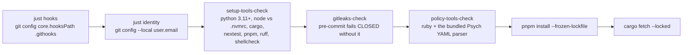

Then prove the bring-up rather than trusting a remembered test count:

```bash
just check                    # cargo check --locked --workspace --all-targets — seconds
mise exec -- just lint        # the full static gate
mise exec -- just test        # cargo nextest + pnpm -r test
just guards                   # every write guard still refuses what it must
just secrets                  # Gitleaks over all reachable history
```

### 9.3 Launch the register and see the UI

```bash
mise exec -- just dev-terminal
```

That is `pnpm --filter terminal tauri dev`. Expect a Vite server on **1420** and then a 1366×768
window. See [§7.1](#71-the-register--appsterminal) for exactly what appears and what to click.

**Hot reload behaviour.** React edits hot-reload. Rust edits rebuild and restart — **the window
disappears and comes back. That is not a crash.**

**Devtools.** Right-click → Inspect Element in a dev build.

**Calling a command from the console.** `withGlobalTauri` is deliberately off, so there is no
`window.__TAURI__`. The documented approach is a dev-only bridge — but note it is **documentation, not
code**: `src/main.tsx` is 15 lines and contains no such block. To use it, add:

```ts
// apps/terminal/src/main.tsx — dev only, never in a release bundle
if (import.meta.env.DEV) {
  const { invoke } = await import("@tauri-apps/api/core");
  (window as unknown as { ipc: typeof invoke }).ipc = invoke;
}
```

then in the devtools console:

```js
await ipc("split_tender", { totalMinor: 1250, parts: 3 })   // → [417, 417, 416]
```

**Front end only, no Tauri window** (the RTL toggle works; `invoke` will reject because there is no IPC
host):

```bash
mise exec -- pnpm --filter terminal dev     # http://localhost:1420
```

**LAN binding** for testing on another device:

```bash
TAURI_DEV_HOST=192.168.1.50 mise exec -- just dev-terminal
```

### 9.4 Launch the server and the database

```bash
# start Docker/colima first — the daemon is not running on this machine
colima start                # or: open -a Docker

just db-up                  # postgres:18-alpine, pinned by digest, --wait for readiness
cp apps/server/.env.example apps/server/.env    # one-time; .env is git-ignored
just migrate                # cd apps/server && sqlx migrate run

just dev-server             # Axum on 127.0.0.1:8080
```

In another shell:

```bash
curl -s localhost:8080/health    | python3 -m json.tool
curl -s localhost:8080/health/db | python3 -m json.tool
curl -si localhost:8080/nope | head -1        # expect 404, not a panic

RUST_LOG=pos_server=debug,sqlx=debug just dev-server   # with logging
```

Inspect Postgres directly:

```bash
docker exec -it pos-postgres psql -U postgres -d pos
# then:  \dt     \d+ sale     select * from _sqlx_migrations order by version;
```

Reset it destructively (development only — this drops the **volume**):

```bash
just db-reset
```

### 9.5 Launch the back office

```bash
mise exec -- just dev-backoffice
# production bundle:
mise exec -- pnpm --filter backoffice build && mise exec -- pnpm --filter backoffice preview
```

### 9.6 Inspecting the register's own database

The register database is **SQLCipher-encrypted**, so the system `sqlite3` reports `file is not a
database` — *which looks like corruption and is not*.

```bash
brew install sqlcipher
sqlcipher "$HOME/Library/Application Support/com.perfectcoders.pos/pos.db"
```

then, and **this must be the first statement**:

```sql
PRAGMA key = 'dev-only-not-a-secret';
.tables
PRAGMA user_version;
```

Or read it through `pos_db::open` in a `#[test]` or dev binary — the only path that works with the OS
credential store.

> **Never copy a register database anywhere for inspection once it contains real data.** That is a
> PDPL matter, not a preference.

Wipe this machine's register database (it is rebuilt empty on next launch):

```bash
just db-local-reset
```

> Today this recipe has nothing to delete: `pos-db` is not wired into the terminal yet. That happens
> in group 1.8.

### 9.7 Running the tests

```bash
just check                                        # does it compile — seconds
cargo nextest run -p pos-domain                   # one crate
cargo nextest run -p pos-domain -E 'test(prop_)'  # every property test
cargo nextest run -p pos-db outbox::              # one module
cargo nextest run -E 'test(inclusive_16pct)'      # one test, anywhere
cargo nextest list --workspace                    # what tests even exist
cargo nextest run -p pos-hardware -- --nocapture  # see the captured byte stream

PROPTEST_CASES=100000 cargo nextest run -p pos-domain -E 'test(prop_)'   # hunt harder
RUST_BACKTRACE=1 cargo nextest run -p pos-db -E 'test(schema_version)'
cargo nextest run --workspace --retries 0         # never mask a flake

mise exec -- pnpm --filter terminal exec vitest   # frontend watch mode
mise exec -- pnpm --filter terminal test          # vitest run
```

---

## 10. The development cycle

### 10.1 The three loops

Never run the outer loop to answer an inner-loop question. A 4-second `cargo check -p pos-domain`
beats a 90-second `just lint` forty times a day.

| Loop | Cadence | Command | Answers |
|---|---|---|---|
| **Inner** | every few seconds | `just check`, `cargo nextest run -p <crate> -E 'test(<filter>)'` | does this compile, does my one test pass |
| **Gate** | before every commit | `just lint && just test` | is the tree healthy |
| **Full** | before every push | `just pre-push` | will CI be green |

`build-web` sits inside `pre-push` for one specific reason: **`tsc` runs nowhere else.** `just lint` is
Biome (style and correctness lints, not the type checker) and `just test` is Vitest, so a TypeScript
type error used to pass every local gate and fail CI's `web` job.

### 10.2 The feature lifecycle — thirteen stations

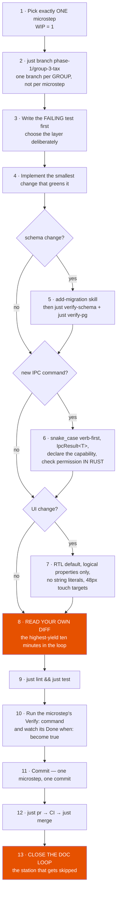

**Station 8's checklist** — read the diff as a reviewer, looking for:

- an `f64`, `as f64` or `/` on money (I-1); a literal `100` near a currency (I-2 — JOD is 3);
- `unwrap()` / `expect()` / `panic!` / `dbg!` outside tests; a new `#[allow(...)]`;
- an `UPDATE` touching a completed sale (I-4); a repository computing a total;
- a fact write without its outbox row in the same transaction (I-9);
- a logged customer name, phone, PAN, PIN, key or token;
- a device clock used for ordering (I-7);
- a file outside the microstep's `Files:` list; a `TODO` with no owner and no microstep number.

**Station 13** is the one that decays. If you deviated from a reference, fix the reference *in the same
commit*. If you completed a numbered product microstep, **move the frontier line in
[`docs/implementation/README.md`](docs/implementation/README.md)** — nothing else maintains it. Then run
`just docs-links` and `just test-catalog`.

### 10.3 Definition of done — all seven, not most

1. The named files exist with the named items.
2. The named tests exist, **named exactly as specified**, and pass.
3. `just lint` is clean.
4. `just test` is clean.
5. The step's **`Done when:`** line is objectively true, *checked by running its command*.
6. **Nothing outside the step's `Files:` list changed** — except imports and module declarations. That
   constraint is what makes a `git bisect` land on a microstep.
7. It is committed with the step number in the message.

> *"A microstep is not done because the code looks finished. It is done because a command said so and
> you watched it happen."*

### 10.4 Adding a migration — the exact sequence

Use the `add-migration` skill, or by hand:

```bash
ls crates/pos-db/migrations/                 # find the next number, no gaps
# author crates/pos-db/migrations/000N_short_name.sql
# append the include_str! entry to MIGRATIONS in crates/pos-db/src/lib.rs
just verify-schema
# mirror into apps/server/migrations/ with a "-- Mirrors SQLite 000N_short_name.sql" header
just verify-pg
cargo nextest run -p pos-db
```

Five rules ([`01-conventions.md`](docs/implementation/01-conventions.md) §9):

1. Append to `MIGRATIONS` in order; `verify-schema.py` requires **exact ordered parity**. Entries must
   be repository-owned regular SQL files — symlinks, gitlinks and devices are forbidden.
2. Idempotent under the runner.
3. A shape-changing migration ships its data migration **in the same file**, plus a test that seeds the
   old shape, migrates, and asserts the new one.
4. Mirror into Postgres with the declared header. SQLx runs a file transactionally unless its bytes
   begin **exactly and case-sensitively** with `-- no-transaction`, which then requires an explicit
   partial-failure recovery test.
5. The app **refuses to start on a half-migrated database** and says why.

### 10.5 Manual testing and the ten drills

Two rules govern all manual testing: **every manual finding becomes an automated test before the fix is
committed**, and **test on the seed fixture, never on ad-hoc data** (`just seed` arrives at 1.12.1;
until then, seed by hand and keep the SQL in `crates/pos-db/tests/`).

The RTL pass, on every UI change:

```bash
grep -rnE '\b(p|m)[lr]-[0-9]|\b(left|right)-[0-9]|text-(left|right)' apps/*/src   # expect no hits
```

then read the debug line (`lang=ar dir=rtl`), toggle the language, confirm the layout mirrors and
**nothing else changes**, check Western Arabic digits, and resize to **1024 × 640**.

The keyboard pass: `F2` search · `F4` pay · `F6` park · `F7` resume · `F9` returns · `Del` void line ·
`+/−` qty · `F12` lock. **Unplug the mouse — literally** — and complete a sale. Scans must land with
no focus at all *and* route correctly while the search box has focus. That last case is where most
implementations break.

The ten drills (`ref/test-catalog.md` marks them `drill`):

| Drill | How | Must happen |
|---|---|---|
| Power cut mid-finalize (E.1) | `pkill -9 -f target/debug/terminal` — match the **build path**, not the word "terminal", or you kill your shell | exactly one sale, one stock event, one outbox row |
| **Real** power loss after the receipt printed (E.1b) | cut actual power, on real hardware | the sale is there on restart. **The only drill that tests durability at all** — `pkill -9` leaves the OS page cache alive |
| App killed with parked carts (E.3) | `pkill -9` with two carts parked | both resume intact |
| Keychain wiped (E.4) | delete the `pos-terminal` entry, relaunch | a named recovery screen — not a panic, not a silent new database |
| Clock moved backwards (E.6) | `sudo date -v-2H`, then sell | audit anomaly; timestamps never decrease; sequences unaffected |
| Day boundary (E.7) | shift opened 00:30 local, cutover 04:00 | shift, sales and Z carry **yesterday's** business date |
| Disk full (E.5) | fill a small disk image | new sales blocked with an alarm, nothing half-written |
| Half-migrated database (E.58) | set `PRAGMA user_version` above `MIGRATIONS.len()` | app refuses to start and says why |
| Backup and restore (G-1) | back up, `just db-local-reset`, restore | every sale still there, byte-identical |
| Two registers, last unit (E.12) | two offline instances both sell it | **both sales stand**; stock goes negative and is flagged |

Restore the clock afterwards: `sudo sntp -sS time.apple.com`.

> **"A drill produces a record or it did not happen."** Each run is a dated file
> `docs/drills/YYYY-MM-DD-<drill>.md` carrying the commit SHA, the hardware, the operator's name, the
> elapsed time, the outcome, and any surprise plus the case number it became. **That directory does not
> exist yet**, and §15's release checklist requires a record in it before a draft may be published.

### 10.6 Every `just` recipe

`just --list` is the only authority on what is runnable. As of `6d997f2`:

| Recipe | Does |
|---|---|
| `just` / `just default` | list the recipes |
| `just setup` | hooks → identity → tool checks → gitleaks → policy tools → `pnpm install --frozen-lockfile` → `cargo fetch --locked` |
| `just hooks` | `git config core.hooksPath .githooks` |
| `just identity` | set the repository-local author email |
| `just check` | `cargo check --locked --workspace --all-targets` |
| `just fmt` | `cargo fmt --all` + `pnpm biome format --write .` |
| `just lint` | node pin · fmt check · clippy `-D warnings` · workspace lints · acyclic · purity · verify-schema · PG mapping · logical CSS · prop names · test catalog · biome · doc links · script lint |
| `just test` | `cargo nextest run --locked --workspace` + `pnpm -r --if-present test` |
| `just build-web` | web-build coverage + `pnpm -r build` — **the only place `tsc` runs** |
| `just guards` | 33 guard self-test invocations |
| `just secrets` | Gitleaks over every reachable commit |
| `just audit` | `cargo deny check` · JS licences · `pnpm audit --audit-level high`. **Deliberately not in `pre-push`** — both halves reach the network |
| `just pre-push` | `lint` · `test` · `build-web` · `guards` · `secrets` |
| `just dev-terminal` / `dev-backoffice` / `dev-server` | the three dev loops |
| `just db-up` / `db-down` / `db-reset` / `db-local-reset` / `migrate` | database lifecycle |
| `just verify-schema` / `verify-pg` | schema parity and the Postgres mirror |
| `just acyclic` / `domain-purity` / `prop-names` / `logical-css` / `workspace-lints` / `docs-links` / `test-catalog` / `lint-scripts` / `node-version-check` | the individual checkers |
| `just bench-gate [budget]` | the performance budgets. **Refuses every run today** |
| `just branch <name>` / `pr [title] [body] [milestone]` / `merge [pr]` / `flow` / `promote-staging` / `promote-main` | the delivery commands |
| `just gh-bootstrap[-dry]` / `gh-project` / `gh-protect` / `gh-actions-policy[-check|-dry]` | GitHub setup |

**Three recipes the workflow document names do not exist yet:** `just seed` (owner 1.12.1),
`just fuzz` (1.2.8), `just test-soak` (2.9.6).

---

## 11. The delivery cycle — branches, PRs and CI

### 11.1 Four branches

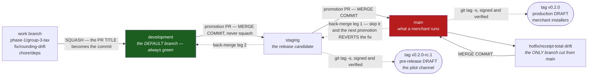

| Branch | Holds | Receives | Produces |
|---|---|---|---|
| `main` | what a merchant is running | a promotion PR from `staging`, or a `hotfix/*` | `v0.2.0` — a production draft release |
| `staging` | the candidate being validated | a promotion PR from `development` | `v0.2.0-rc.1` — a pre-release, the pilot channel |
| `development` | everything merged and green — **the default branch** | a squash-merged PR from a work branch | nothing; it is the integration surface |
| work branches | one **group** of microsteps | your commits | one squashed commit on `development` |

**Why four and not one.** Trunk-based single-`main` is right for a web service where "revert and
redeploy" takes four minutes. This ships **installers**: a wrong build on a merchant's register is not
reverted by a deploy — it is reverted by a phone call, a site visit, and a database that has already
recorded sales against the wrong version.

**Why the merge button matters.** A work PR is **squash-merged**, and GitHub commits the *PR title*
(`squash_merge_commit_title=PR_TITLE`) — which is exactly why the PR title is validated against the
commit grammar. A promotion PR is merged with a **merge commit**, because squashing one rewrites the
commits into a new one, `staging` no longer shares history with `development`, every subsequent
promotion re-proposes the same work, `just flow` becomes meaningless, and the only fix is to delete and
recreate the branch. **Rebase-merge is disabled at the repository level.**

### 11.2 The commit grammar

```
<type>(<scope>): <summary>  [<step>]

feat(domain): tax engine, inclusive + exclusive extraction   [1.3.4]
fix(db): sale_line qty to milli-units                        [1.1.7]
docs(impl): phase 2 fiscal conformance harness               [—]
```

Both lists are **closed**:

- `type` ∈ `feat` `fix` `test` `docs` `chore` `refactor` `perf`
- `scope` ∈ `domain` `db` `sync` `hardware` `fiscal` `terminal` `server` `backoffice` `repo` `impl`
- `step` = one microstep (`1.3.4`, optionally lettered `1.1.2a`), an **en-dash** range (`1.3.4–1.3.6`),
  or an **em-dash** `—` for repository work outside the plan. *Those are two different characters.*
- summary **≤ 72 characters** before the step tag, no trailing period.

[`scripts/validate-change-title.sh`](scripts/validate-change-title.sh) is the **shared parser** used by
both `.githooks/commit-msg` (commit subjects) and the `branch-flow` CI check (PR titles). There is
deliberately not a second regex in a workflow file.

**No AI attribution.** Coding assistants are tools, not co-authors: no `Co-Authored-By` trailer, no
generated-by line, in commits or PR bodies. The one narrow exception is the exact Dependabot
author/email + trailer combination, and the code itself says why that is not proof of anything: *Git
author metadata is locally configurable, so this is not cryptographic proof of GitHub App identity.*

### 11.3 The daily command sequence

```bash
just branch phase-1/group-3-tax          # validates the name, pulls development, cuts the branch
# ... work the microsteps, commit each one ...
just pr 'feat(domain): tax engine, inclusive + exclusive extraction   [1.3.4]'
just merge                               # only merges once the derived required checks are green
```

`just pr` does more than it looks:

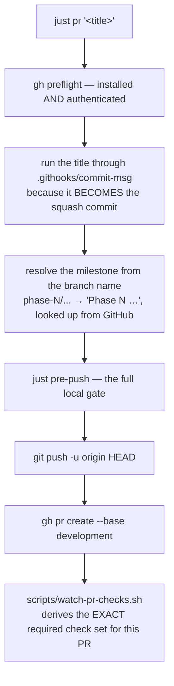

`just merge` is the recipe that exists because of a specific incident, recorded in its own comment:
*"#18 was merged with `rust` failing, and `just lint` was red on development from that merge until it
was repaired."* It takes a **ten-field NUL-separated snapshot** of the PR, refuses a non-open or draft
PR, a base other than `development`, a head named `development|staging|main|hotfix/*`, and an illegal
route; watches the derived check set; **re-reads the snapshot and requires all ten fields identical**;
then merges with `--match-head-commit … --squash --delete-branch`.

There is **deliberately no override flag.** A policy PR is *expected* to be red on
`branch-flow/protected-paths` — that red **is** the manual security review — and taking it is a decision
you make explicitly with `gh pr merge` after reading the diff.

### 11.4 CI

Six workflows. `ci.yml` runs on push to and PR into `development`, `staging`, `main`:

```mermaid
flowchart TD
    subgraph ci["ci.yml"]
        R["rust · ubuntu · 40 min<br/>WITH a postgres:18-alpine service<br/>fmt · clippy -D warnings · nextest ·<br/>workspace lints · acyclic · purity · prop names ·<br/>verify-schema · verify-pg --verbose"]
        G["guards · ubuntu · 15 min<br/>~30 negative tests: every guard still refuses"]
        W["web · ubuntu · 25 min<br/>node pin · biome ci · logical CSS · vitest ·<br/>build coverage · pnpm -r build (tsc!) · doc links"]
        SC["supply-chain · ubuntu · 20 min<br/>Gitleaks over the commit RANGE ·<br/>attribution over history · cargo-deny ·<br/>JS licences · pnpm audit"]
        CP["cross-platform · 60 min · CONDITIONAL<br/>only when base or ref is staging/main<br/>ubuntu-22.04 · macos-latest · windows-latest<br/>4 crates + a REAL tauri build"]
    end
    subgraph bf["branch-flow.yml — pull_request_target, contents: read"]
        PP["protected-paths<br/>frozen surface · plan/migration edits ·<br/>attribution · Actions allowlist"]
        TP["topology<br/>legal head→base route · title grammar"]
        PN["promotion-notice<br/>warns on exactly the PRs where<br/>squashing would fork the branches"]
    end
    S["security.yml<br/>actionlint + zizmor · weekly full-history scan"]
    L["labeler.yml<br/>area:/risk: by path, type: from the title"]
    P["proptest-scheduled.yml<br/>Saturday 02:37 UTC, PROPTEST_CASES=100000"]
    RL["release.yml<br/>tags v* ONLY"]

    style CP fill:#e65100,color:#fff
    style RL fill:#0d47a1,color:#fff
```

**Local mirrors:**

| CI job | Local equivalent |
|---|---|
| `ci/rust` | `just lint && just test && just verify-pg` — *but it does not run the test-catalog reconciler* |
| `ci/guards` | `just guards` |
| `ci/web` | `just lint && just test && just build-web` |
| `ci/supply-chain` | `just secrets && just audit` |
| `ci/cross-platform` | run the platform tests and the Tauri build on each OS |

**The `pull_request_target` boundary** deserves a note, because it is the piece most repositories get
wrong. A `pull_request` workflow definition comes from the PR's *own head* — so a PR could delete the
check that judges it. `pull_request_target` makes GitHub read the workflow from the **trusted default
branch**. The usual cost is a write-capable token and secret access; this workflow neutralises both:
`permissions: contents: read`, no `secrets.*` reference anywhere, every checkout pinned to
`ref: ${{ github.workflow_sha }}` with `persist-credentials: false`, and the untrusted head fetched
into `$RUNNER_TEMP/candidate` as a worktree created with `core.hooksPath=/dev/null` — **data, never
code**. Trusted scripts in `$GITHUB_WORKSPACE` are invoked *with the candidate path as an argument*.

### 11.5 What is actually enforced — the honest table

> ```
> $ gh api repos/OmarSweiti/pos/branches/main/protection
> 403  Upgrade to GitHub Pro or make this repository public to enable this feature.
> ```

**This repository is private on the GitHub Free plan.** Branch protection *and* rulesets are both
gated, and `CODEOWNERS` is inert. That is not a detail — it decides which rules are laws and which are
merely written down.

```mermaid
flowchart TD
    A["A change"] --> B["Agent hooks<br/>.claude/ and .codex/<br/><i>FAIL OPEN by design, except settings validation</i>"]
    B --> C["Git hooks<br/>.githooks/<br/><i>local — --no-verify or a clone that skipped just setup bypasses them</i>"]
    C --> D["CI<br/><i>visible and logged — NOT a required-check wall</i>"]
    D --> E["A human reading the diff<br/><i>the only real gate on this plan</i>"]
    style E fill:#1b5e20,color:#fff
    style B fill:#616161,color:#fff
```

Consequences you must hold in your head:

- **No CI job is a required check.** Nothing prevents the administrator merging a red PR. The "required
  set" is a **client-side** construct that `scripts/watch-pr-checks.sh` derives and `just merge`
  refuses without.
- **A clone that has not run `just setup` has zero local protection**, because the hooks live in
  `core.hooksPath`. Nothing closes this; it is inherent to hook-based enforcement.
- **`scripts/check-test-catalog.py` is the one checker in the local `just lint` gate with no `ci.yml`
  step.** On this repository it is only as strong as the person who ran `just lint`.
- **Auto-merge is deliberately never enabled**: without required checks, auto-merging would remove the
  deliberate human green-check decision that is the only real gate.

---

## 12. The production cycle — release and deployment

### 12.1 There is no server deployment yet

Say this plainly, because the branch names invite the wrong reading: **`staging` means "a tagged
candidate", not "a running system".** There is no hosted environment for `apps/server`, no server
backup, no tested restore, no monitoring and no on-call. That is group 3.10.

What ships is **installers**. Deployment is a merchant installing a build on a register.

### 12.2 The release pipeline

Releases are **tag-driven only** — `on: push: tags: ["v*"]`. There is no promotion trigger, no
`workflow_dispatch`. A promotion PR merging into `staging` or `main` does *not* start a release; a
human then creates a **signed annotated tag** on the merge result and pushes it.

| Tag | Tagged on | Result |
|---|---|---|
| `v0.2.0-rc.1` | `staging` | a **pre-release draft** — the pilot channel |
| `v0.2.0` | `main` | a **production draft** release |

```mermaid
sequenceDiagram
    autonumber
    participant H as Human
    participant G as guard job
    participant B as build matrix
    participant S as sbom job
    participant P as publish job
    participant R as GitHub Release

    H->>H: version-bump PR through the normal path<br/>Cargo.toml + tauri.conf.json + package.json
    H->>H: promotion PR → staging, MERGE COMMIT, watch CI
    H->>G: git tag -s v0.2.0-rc.1 && git push origin refs/tags/...
    G->>G: 1 tag grammar decides the channel
    G->>G: 2 signed, annotated, VERIFIED, and the exact branch TIP
    G->>G: 3 four-way version agreement
    G->>G: 4 updater signing configured in the app
    G->>G: 5 ci.yml succeeded for THIS exact SHA on that branch
    Note over G: all five, before spending money on the matrix
    G->>B: macOS universal · ubuntu-22.04 (oldest glibc) · windows
    B->>B: tauri-action, pinned to a full commit SHA
    B->>S: artifacts
    S->>S: SPDX JSON SBOM + SHA-256 manifest
    S->>P: attach to the still-DRAFT release
    P->>R: minimal contents: write, NO signing secrets
    H->>R: verify_release_tag, then gh release edit --draft=false
```

The permission split is the professional part: platform build/sign jobs hold a **read-only** repository
token plus signing material; a separate minimal publisher holds the write token and **no signing
secrets**. Published releases are immutable.

**`verify_release_tag`** asserts, immediately before publishing, that the ref object type is `tag`, its
SHA equals the retained tag object, the tag's target is a `commit` with the expected SHA, and
`isDraft` is *still* `true`.

A failed release job must be restarted with **Re-run all jobs** (`gh run rerun "$id"`, never `--failed`
or `--job`), because every artifact name includes `github.run_attempt` and the publisher accepts only
one attempt's set.

### 12.3 What blocks the first external release

This is deliberate, and it is documented in [`SECURITY.md`](SECURITY.md):

| Blocker | Owner |
|---|---|
| `tauri.conf.json` has **no `bundle.createUpdaterArtifacts`** and **no `plugins.updater.pubkey`** — the guard job hard-fails without both | microstep **5.5.0**, on an offline signing host |
| OS code signing: Windows Authenticode, Apple Developer ID + notarisation | **5.5.1** |
| `release.yml` still passes `TAURI_SIGNING_PRIVATE_KEY` to the **same step that compiles third-party code** — any build script or proc macro in the dependency graph can read it. The document calls this row *"a requirement, not a control"* | **5.5.1** |
| No update service: no manifest endpoint, no cohort assignment | **5.5.0 / 5.5.2** |
| No `docs/drills/` record, no reference-register benchmark run, no recorded migration duration | 1.2.0 deferred half, 5.5.3 |

Version discipline: `0.x` while pre-pilot; the minor moves with a phase gate, the patch with a fix; **a
bad build is a new patch tag, never a moved tag.** `.githooks/pre-push` refuses moving or deleting an
existing tag.

### 12.4 The hotfix path

`hotfix/<slug>` is the **only** branch kind that cuts from `main`. It sets the patch version **in the
same PR** (otherwise the signed tag cannot pass the four-way version check), merges into `main` with a
**merge commit**, gets tagged — and then, *immediately*, back-merges `main → staging` and
`staging → development`, each with the same watcher/recheck/merge-commit ritual.

**Skipping either back-merge leg means the next promotion silently reverts the hotfix.**

---

## 13. The safety layers, and their honest limits

```mermaid
flowchart TB
    subgraph agent["Agent time — .claude/ and .codex/"]
        A1["protect-immutable.py<br/>PreToolUse on Read|Grep|Glob|Edit|Write|Bash|PowerShell|Monitor"]
        A2["docs-links-on-write.py<br/>PostToolUse — no broken cross-reference survives a Markdown edit"]
        A3["validate-settings.py<br/>ConfigChange — the ONE hook that FAILS CLOSED"]
        A4[".claude/rules/*.md<br/>3 path-scoped + security.md, which has NO path scope"]
    end
    subgraph git["Git time — .githooks/"]
        G1["commit-msg<br/>title grammar + no assistant attribution"]
        G2["pre-commit<br/>protected paths, oversized blobs, plan/migration edits, Gitleaks on staged content"]
        G3["pre-push<br/>no direct/force push to the three branches, no moved tag, Gitleaks over history"]
    end
    subgraph ci2["CI time"]
        C1["check-protected-paths.sh<br/>asks 'committed?' of the BASE"]
        C2["check-branch-workflow-policy.rb<br/>byte-freezes the whole policy surface"]
        C3["gh-actions-policy.sh<br/>full-SHA pins + a 14-entry allowlist"]
    end
    agent --> git --> ci2
    style A3 fill:#1b5e20,color:#fff
```

### 13.1 What each layer actually refuses

| Guard | Refuses |
|---|---|
| [`.claude/hooks/protect-immutable.py`](.claude/hooks/protect-immutable.py) | writing, deleting or moving a **committed migration** or anything in `docs/plan/` — through Claude write tools, Bash, PowerShell or Monitor. Also blocks reads of `.env`-shaped and key-shaped paths |
| [`.claude/hooks/docs-links-on-write.py`](.claude/hooks/docs-links-on-write.py) | leaving a broken cross-reference after **any** tracked `.md` changes |
| [`.claude/hooks/validate-settings.py`](.claude/hooks/validate-settings.py) | a session-time weakening of the reviewed settings, or the loss of a required skill contract. **Fails closed** |
| [`.githooks/commit-msg`](.githooks/commit-msg) | a title outside the grammar, or assistant attribution |
| [`.githooks/pre-commit`](.githooks/pre-commit) | protected/sensitive paths, oversized staged blobs, plan or committed-migration edits, Gitleaks findings in **staged content** |
| [`.githooks/pre-push`](.githooks/pre-push) | direct/force/deletion pushes to the three flow branches, moving or deleting an existing tag, attribution, or a secret anywhere in reachable history |
| [`scripts/check-protected-paths.sh`](scripts/check-protected-paths.sh) | a PR that edits a source plan or a migration **already present in its base**. Asking of the *base* is what makes adding a new migration legitimate and editing an old one not |
| [`scripts/check-branch-workflow-policy.rb`](scripts/check-branch-workflow-policy.rb) | any byte change to the frozen policy surface — every workflow, every Git hook, every `.claude/`/`.codex/` file, `AGENTS.md`, `CLAUDE.md`, the labeler/Dependabot config, `.gitattributes`, the justfile — without an explicit red-and-reviewed edit |

**Every one is negative-tested.** `just guards` runs 33 suites that prove each guard still *fails* on a
deliberately introduced fault. The principle is stated outright: **"a guard nobody has seen fail is a
guard nobody should trust."**

### 13.2 The limits, stated honestly

These are not caveats to skim. Describing this posture as stronger than it is, is itself a defect:

- **The agent-time guards fail OPEN by design** (except settings validation and the `.env`-read arm).
  An internal parser error emits a visible structured warning and exits 0.
- **The shell arm is defence in depth, not a proof.** It follows `cd`, covers redirects, output flags,
  copy destinations and PowerShell verbs — but a dynamically constructed path defeats it, and that is
  an *asserted passing allow case* in the test suite, not a bug. Git hooks and CI are the mandatory
  post-write backstops.
- **Claude's OS sandbox is intentionally disabled**, so permitted package-manager, Git/SSH and GitHub
  commands can use the host normally. The `permissions.deny` list governs **Claude's own tools, not
  subprocesses**: a permitted shell command has ambient host filesystem, network, environment and
  credential access. Do not describe this as OS containment or credential scrubbing.
- **Native Windows hook dispatch is unverified.** Both hook sets carry Windows command paths, and the
  tests execute those command strings on the current host, but no test runs them through native Windows
  dispatch.
- **The attribution deny-list is an enumeration and it lags, by design.** There is no generic signal —
  the obvious one (`noreply@`) is what GitHub gives real humans who keep their address private.

---

## 14. The plan of record — phases and the current frontier

### 14.1 The document set

```mermaid
flowchart TD
    C["CLAUDE.md<br/><i>cross-agent overview, the nine invariants on one screen</i>"]
    A["AGENTS.md<br/><i>the Codex entry point for the same law</i>"]
    R["docs/implementation/README.md<br/><i>the index + the dated FRONTIER line</i>"]
    M["00-master-plan.md<br/><i>the spine — and §4a, the errata ledger</i>"]
    L["01-conventions.md<br/><i>THE LAW — where it and a phase file disagree,<br/>it wins and the phase file is a bug</i>"]
    W["02-development-workflow.md<br/><i>the daily loop, every command, the drills</i>"]
    G["03-github-workflow.md<br/><i>branches, PRs, promotions, §3's honest table</i>"]
    P["phase-0 … phase-5<br/><i>296 numbered microsteps</i>"]
    REF["ref/ — 12 NORMATIVE reference documents"]
    SRC["docs/plan/ — IMMUTABLE source plans"]

    C --> A --> R --> M --> L --> W --> G --> P --> REF
    SRC -.->|"reads as current truth<br/>until §4a says otherwise"| M
    style L fill:#1b5e20,color:#fff
    style SRC fill:#b71c1c,color:#fff
```

The twelve reference documents under [`docs/implementation/ref/`](docs/implementation/ref/) are
**normative** — the phase files are summaries of them:

| Document | Answers |
|---|---|
| [`schema.md`](docs/implementation/ref/schema.md) | every migration `0001`–`0012`, ~120 tables, ~330 triggers. 6,554 lines, the largest file here |
| [`domain-api.md`](docs/implementation/ref/domain-api.md) | every `pos-domain` type and signature, across 17 modules |
| [`ipc-contract.md`](docs/implementation/ref/ipc-contract.md) | all ~94 Tauri commands with capability, audit flag and approval binding |
| [`sync-protocol.md`](docs/implementation/ref/sync-protocol.md) | ownership, commit groups, cursors, chaos drills, **accepted risks** |
| [`tax-jordan.md`](docs/implementation/ref/tax-jordan.md) | GST as an engine, `rate_ppm`, effective dating |
| [`fiscal-jofotara.md`](docs/implementation/ref/fiscal-jofotara.md) | the highest-risk component, and the `pos-fiscal` layout |
| [`hardware-and-receipts.md`](docs/implementation/ref/hardware-and-receipts.md) | traits, Arabic raster pipeline, the lab checklist, §6a.1's blank register matrix |
| [`ui-spec.md`](docs/implementation/ref/ui-spec.md) | screens, RTL, the keyboard map |
| [`security-compliance.md`](docs/implementation/ref/security-compliance.md) | the sensitive-field registry, PDPL, PCI, key custody, audit chain |
| [`test-catalog.md`](docs/implementation/ref/test-catalog.md) | 92 edge cases → named tests, mechanically reconciled |
| [`merchant-decisions.md`](docs/implementation/ref/merchant-decisions.md) | the questionnaire — what only the merchant can answer |
| [`plan-validation.md`](docs/implementation/ref/plan-validation.md) | the audit of record, with dated revision notes |

### 14.2 Microstep numbering

Microsteps are `<phase>.<group>.<step>` and **the numbers are stable** — they are commit-message
references and checklist IDs. A `.0` step is a *precondition* inside its group. Letter suffixes
(`1.1.2a`, `1.8.5b`) split a step that cannot compile in its numbered order.

**Step order is not build order.** Group 1.1 carries an explicit build-order table because, written in
numbered order, `1.1.2` asks for `mul_qty`/`mul_percent`/`round_to_step` while `Qty` is `1.1.3`,
`Percent` is `1.1.4` and `RoundingRule` is `1.1.6`.

### 14.3 The phase map

| Phase | Exit statement | Microsteps | Effort |
|---|---|---|---|
| **0 — close-out** | the scaffold becomes a foundation | 14 items | closed by transfer (13/14; `0.3.2` re-homed to `5.5.0`) |
| **1 — sellable MVP** | a real Jordanian minimarket could sell for cash, all day, fully offline, in Arabic, with correct GST and a printed receipt | **112** | 14–20 weeks |
| **2 — money-grade** | cards that reconcile to the fil, returns without fraud, a shift that balances, fiscal documents that pass every check short of the ISTD network | 61 | 10–13 weeks |
| **3 — connected** | two registers and a back office converge through a week of offline chaos | 45 | 11–14 weeks |
| **4 — depth** | three stores run a full week unattended, with promotions whose cost report matches finance's arithmetic | 42 | 9–12 weeks |
| **5 — harden & launch** | the product can be sold to someone who is not you, with a compliance story you could defend to an auditor, a QSA and a tax advisor in the same week | 36 | 9–13 weeks |

**Total: roughly 53–72 weeks solo.**

### 14.4 Where the work is right now

Phase 1 group graph, with what has landed marked:

```mermaid
flowchart TD
    G11["1.1 domain foundations<br/>Money · Qty · ids · time<br/>✅ 10 of 10 buildable done"]
    G12["1.2 catalog, barcodes, search<br/>✅ 1.2.1 migration 0003 · ✅ 1.2.2 Product<br/>⬜ 1.2.4 scan parser is OPEN"]
    G13["1.3 tax engine<br/>⬜ 1.3.1 is OPEN"]
    G14["1.4 cart state machine"]
    G15["1.5 cash tenders"]
    G17["1.7 receipts — the Arabic problem"]
    G16["1.6 users, permissions, audit<br/>⬜ 1.6.3 is OPEN"]
    G19["1.9 shifts, sequences, business date"]
    G110["1.10 stock ledger"]
    G18["1.8 persistence and the money moment<br/>✅ 1.8.9 outbox writer JUST LANDED"]
    G111["1.11 terminal UI — RTL, i18n"]
    G112["1.12 seed fixture, benchmarks, gate"]

    G11 --> G12 --> G14
    G11 --> G13 --> G14
    G14 --> G15
    G14 --> G17
    G16 --> G18
    G19 --> G18
    G110 --> G18
    G15 --> G18
    G17 --> G18
    G18 --> G111 --> G112

    style G11 fill:#1b5e20,color:#fff
    style G18 fill:#1b5e20,color:#fff
    style G12 fill:#e65100,color:#fff
```

**As of `6d997f2`, Phase 1 has 14 of 112 microsteps fully complete (~13%)** — group 1.1 in full, plus
`1.2.1` (migration `0003`), `1.2.2` (`Product`), `1.8.9` (the outbox writer) and `1.8.5` (the release
build's key policy, proven *in a release build*). Two are deliberately *partially delivered*:

- **`1.1.9`** — the pure-domain time values, clock policy and terminal IANA-zone resolution have
  landed; the database half is deferred until `1.9.1` creates `trusted_time_state`.
- **`1.2.0`** — the benchmark gate, its fourteen refusal-path tests and
  `benchmarks/reference-register.toml` are all committed with **every identity value deliberately
  blank**, so `python3 scripts/bench-gate.py --check-profile` **exits non-zero**. That is conventions
  §7.1 working, not failing: no reference register has been bought, and §7.1 accepts no baseline
  against a blank record.

**What to build next.** With `1.8.9` merged, **the gate it held is open**: groups 1.6, 1.9 and 1.10 may
now write append-only facts, because every fact graph commits with its delivery envelope and the writer
refuses to return success on an incomplete one. Four microsteps now have every dependency met and none
blocks another:

| Next | What | Why it is worth starting |
|---|---|---|
| `1.2.4` | the scan parser's pure half | next in §1.2's own build order |
| `1.3.1` | tax types | **opens the longest critical path in the phase** |
| `1.6.3` | capabilities and the default role matrix | must be designed *before* migration `0004` seeds it — adding it afterwards would violate the forward-only law |
| `1.6.5` | the audit hash chain | independent lane |

None of them is blocked on the merchant's legal name or TIN, which instead gate store provisioning and
the issuing of a valid tax receipt.

> ⚠️ **Check the frontier line yourself.** [`docs/implementation/README.md`](docs/implementation/README.md)
> carries a dated frontier paragraph maintained by station 13 and by nothing else. It says outright:
> *"It is a dated convenience, not a source of truth: the delivery board and the merged history are.
> If the two disagree, the history is right and this line is a bug."* It has already drifted twice.

### 14.5 The seven open items that block Phase 1

Find them with `grep -rn 'OPEN — blocks 1\.' docs/implementation/` — exactly seven hits.

Two of them **cannot be resolved by writing code**, and they are the reason Phase 1 cannot be *declared*
done however complete the implementation is:

| Question | Owner | Default running today |
|---|---|---|
| The tie rule, cash-rounding step and tax treatment for the Jordan jurisdiction policy | `1.3.4` | **no `tax_computation_policy` row is approved — store provisioning and finalization stay blocked.** All ten exit demonstrations require finalizing a sale |
| Which JSMO mark proves a trade scale is verified | `1.2.4` | **`embedded_barcode_rule.is_active` stays `0` — no scale-derived price reaches checkout.** Exit demonstration 2 requires selling a weighed item via a price-embedded barcode |

The other five: the SST/GST combined taxable base (`1.3.5`), which `ZeroRatingReason` values the filing
return distinguishes (`1.3.2`), which effective-dated tax packs apply to the assortment (`1.3.7`),
whether the bundled SQLCipher runtime carries the upstream WAL-reset corruption fix (`1.8.1` — the one
that can still change an architecture), and which second factor exists on a Jordanian minimarket counter
(`1.6.2`).

Every open item follows the same shape: a greppable `⚠️ OPEN` block carrying **the question, the default
until it is answered, the owning microstep, and the source that settles it**. And the governing rule:
**a default is what the code does today, not an answer.**

### 14.6 The four corrections, two of which were wrong

Research found four claims in the business master plan that were wrong. A later independent audit found
that **two of the corrections were themselves wrong** — both in the direction that matters: each would
have *rejected valid fiscal documents*.

| | Original correction | Now |
|---|---|---|
| **C-1** | JoFotara has no sandbox, so Phase 2's exit gate is unbuildable | **Retained**, premise narrowed. The *specification* is obtainable, so pinning it moved into microstep **`2.7.0`**, ahead of every fiscal build step |
| **C-2** | ISTD rejects global discounts — convert to a percentage and gate on an exact round-trip | **SUPERSEDED — do not implement.** Largest-remainder proration to exact line allowance *amounts*, plus a document recap equal to their sum. *"A percentage is provenance, never an eligibility gate."* |
| **C-3** | ISTD recomputes at 9 decimals, tolerating < 0.001 JOD drift | **SUPERSEDED — the tolerance is not sourced.** The local check is a half-fil per-line comparison plus exact identities over the document's own carried values |
| **C-4** | Thresholds 75k goods / 30k services / 10k special-tax goods | **Numbers retained, categories corrected.** The 10k class is the *producer* of SST goods; a minimarket that resells tobacco does not enter it |

---

## 15. Industry standards — what this repo does, and why

This section is the "how does professional practice work" answer. Each row is a recognised industry
practice, what this repository does about it, and — where relevant — where it deliberately deviates.

### 15.1 Architecture and domain modelling

| Practice | Here |
|---|---|
| **Ports and adapters / hexagonal architecture** | `pos-domain` is the hexagon: pure, dependency-free, testable in isolation. `pos-db`, `pos-hardware` and the Tauri shell are adapters. `IdSource` and `Clock` are *ports* — time and identity are injected, not acquired |
| **The Money pattern** (Fowler) — never a float, always minor units with an explicit currency | I-1 and I-2, enforced by a denied clippy lint, a schema auditor that refuses `REAL`, a TypeScript guard that throws, and the removal of `Ord` from `Money` so a currency mismatch cannot be silently compared |
| **Event sourcing / append-only ledgers** for financial data | Sales are immutable facts; corrections are new documents. Stock is a ledger with a rebuildable cache. Tender settlement and shift close are *append-only transition facts* with rebuildable projections — not `UPDATE`s |
| **CQRS-flavoured projections** | `stock_cache`, `tender_status_current`, `shift_state` are all rebuildable projections of an append-only source, with a CI-run rebuild command as the correctness proof |
| **Offline-first with a transactional outbox** | The classic microservices outbox pattern, applied at the register. The refinement here is the **commit group**: the unit of delivery is a whole business transaction, so the server can never accept a header without its lines |
| **Domain-driven design vocabulary discipline** | A 19-row naming table binds a *kind of thing* to a spelling, so a column name is machine-checkable rather than a taste question |

### 15.2 Testing

| Practice | Here |
|---|---|
| **The test pyramid, made explicit** | Nine named layers: example · property · golden · integration · concurrency · fuzz · packaged-app · chaos · soak. Each has a home directory and a runner |
| **Property-based testing** | Every business rule ships a `prop_<invariant>` test, at **4,096 cases** for domain crates. The prefix is load-bearing: a phase gate filters on it, so a dropped prefix would silently omit a property — hence `scripts/check-prop-test-names.py` |
| **Golden-file testing** | Receipt bytes and fiscal XML. With a rule most teams miss: a raster golden ships a committed `.png` beside its `.bin`, because *"a hexdump cannot show a lost medial form"* in Arabic |
| **Compile-fail testing** | `trybuild`, because a typed ID whose whole purpose is that `f(line_id, sale_id)` does not compile cannot be proven by a test that compiles |
| **Deterministic tests, no flake tolerance** | *"A flaky test in a money system is worse than no test, because it teaches you to ignore red."* No test reads the wall clock or generates a random UUID outside proptest's control. Quarantine within the hour; **never re-run CI to get green** |
| **Negative-testing the safety net** | `just guards` proves each guard *fails* on a planted fault. This is unusual and it is the right instinct |
| **A coverage matrix that is executable, not decorative** | The 92-case catalogue is reconciled against the suite, the phase files and its own arithmetic. It exists because a hand-maintained table once counted 73 cases against a stated total of 72 |

### 15.3 Delivery and CI/CD

| Practice | Here |
|---|---|
| **Conventional Commits** | Extended with a mandatory `[<step>]` tag, and both lists closed. One shared parser for Git and GitHub |
| **Trunk-based vs. release branching** | Deliberately **not** trunk-based — the honest reasoning is in §11.1: this ships installers, not a deploy |
| **Squash for work, merge commits for promotions** | Enforced by convention, refused by `just merge`, and warned about by a dedicated CI job on exactly the PRs where getting it wrong is permanent |
| **Immutable, verifiable releases** | Signed annotated tags, exact-tip validation, four-way version agreement, CI-green-for-this-SHA, split build/publish permissions, SBOM + checksums, immutable published releases |
| **Supply-chain security** | Every `uses:` pinned to a **full commit SHA** with a 14-entry allowlist; `cargo-deny` for advisories/licences/bans; a reviewed JS licence policy; digest-verified linter downloads; Dependabot **monthly and grouped**, because *"an unread dependency bump is how a supply-chain problem arrives politely"* |
| **Defence against `pull_request_target`** | The textbook implementation: trusted workflow revision, read-only token, no secrets, untrusted head materialised as **data** in a hooks-disabled worktree outside the workspace |
| **Reproducible toolchains** | One pin per toolchain, in one file. `rust-toolchain.toml` read by a `sed` one-liner in four jobs rather than `@stable`; `.nvmrc` read by every `setup-node` and cross-checked against four other declarations |

### 15.4 Security and compliance

| Practice | Here |
|---|---|
| **Never log PII — as executable policy, not prose** | One `SENSITIVE_FIELD_RULES` registry with exact-name, suffix and contains rules, from which the tracing layer, the scrubber tests, the audit-payload guard, the diagnostic bundle and the telemetry transport all derive |
| **Making a leak a compile error** | `IpcError.detail` is `Option<&'static str>`, not `Option<String>`. A SQL error carrying a bound parameter, a PSP failure body or a panic message *cannot* be assigned to it |
| **Least privilege at every layer** | Deny-by-default Tauri capabilities; permission checks in Rust, never by hiding a button; split release job permissions; `contents: read` everywhere it can be |
| **Secrets management** | Key in the OS credential store, never a file, never an env var in release. `POS_DB_KEY` is dev/CI only and is **ignored-and-continued** in release |
| **Separation of duties** | `actor != approver` on every approval path, unconditionally. Blind cash close enforced **on the wire**, not in the UI — `report_x` omits the expected figure from the very user who will close the drawer |
| **Not claiming compliance you have not earned** | An explicit, enforced prohibition on the words "PCI compliant", "SAQ done" or "JoFotara certified" anywhere — code, comments, docs, UI copy or a commit message. Until the credentialed items are signed, the only permitted fiscal claim is the exact wording *"passes our conformance harness against the pinned specification"* |

### 15.5 Documentation

| Practice | Here |
|---|---|
| **Docs-as-code** | Documentation lives in `docs/`, versioned with the code, reviewed in the PR that changes behaviour, checked by CI. You can check out `v0.2.0` and read the documentation as it was when that build shipped |
| **One owner per fact** | Every rule has exactly one home. `docs/orientation.md` states its own past failure: it used to carry a nine-line invariant summary that *drifted from the law it summarised* — hence pointers, not copies |
| **An errata ledger for frozen inputs** | §4a. Because the source plans are immutable and a reader is routed to them first, a superseded table name reads as current truth until something says otherwise |
| **Recording that a correction was wrong** | Two of four corrections were themselves wrong and are marked in place. *"Leaving an audit reading as still-true is how a fix becomes a defect"* |
| **Stating limits, not just controls** | §3's honest table, the enforcement-limits table, the accepted-risks table. *"A vendor who claims none of these exist is either not offline-first or not being straight with you"* |

### 15.6 Performance

The professional instinct here is the one most teams get wrong: **`cargo bench` prints a number and
exits 0 whatever that number is.** A budget without a command that exits non-zero is a wish.

Five budgets, each with a limit, a measurement method, a sample count, a machine and an owning
microstep:

| Budget | Limit | Owner |
|---|---|---|
| Scan → line visible | p99 < 100 ms | 1.11.13 |
| Cart total recompute, 200 lines | p99 < 16 ms | 1.4.9 |
| Search-as-you-type over 50k SKUs | p99 < 50 ms | 1.2.7 |
| Cold start → sellable | **median** < 3 s | 2.9.3 / 2.9.5 |
| PIN verification | median **band** 200–350 ms *and* p99 < 500 ms | 1.6.2 |

That PIN band is a detail worth stealing: *a 40 ms PIN median passes the ceiling and is still a
failure, because Argon2 that fast is a weak parameter set.*

The regression rule fails only when the median is **more than 20% slower AND more than three baseline
median absolute deviations slower** — both conditions, because either alone is a flake generator. And a
baseline outside its own absolute limit is refused outright, so **a red gate cannot be repaired by
republishing the slow number.**

---

## 16. Command reference — everything in one place

### Bring-up

```bash
just setup                                   # not optional — hooks land before dependencies
cp apps/server/.env.example apps/server/.env # one-time
export POS_DB_KEY=dev-only-not-a-secret      # shell profile, never a repo file
```

### Run the applications

```bash
mise exec -- just dev-terminal               # the register: Vite 1420 + a 1366x768 Tauri window
mise exec -- just dev-backoffice             # the admin SPA
just dev-server                              # Axum on 127.0.0.1:8080
mise exec -- pnpm --filter terminal dev      # front end only, no Tauri host
TAURI_DEV_HOST=192.168.1.50 mise exec -- just dev-terminal   # bind to the LAN
```

### Databases

```bash
just db-up                                   # dev Postgres, waits for readiness
just migrate                                 # sqlx migrate run
just db-reset                                # DESTRUCTIVE: drops the volume, re-migrates
just db-down                                 # stop, keep the volume
just db-local-reset                          # wipe THIS machine's register database
docker exec -it pos-postgres psql -U postgres -d pos
sqlcipher "$HOME/Library/Application Support/com.perfectcoders.pos/pos.db"
```

### The inner loop

```bash
just check                                   # cargo check --locked --workspace --all-targets
cargo check -p pos-domain                    # one crate, fastest possible signal
cargo nextest run -p pos-domain -E 'test(prop_)'
cargo nextest run -p pos-db outbox::
cargo nextest list --workspace
bacon                                        # continuous check/clippy/test
```

### The gates

```bash
mise exec -- just lint
mise exec -- just test
mise exec -- just build-web                  # the only place tsc runs
just guards
just secrets
mise exec -- just pre-push                   # all five, in order
mise exec -- just audit                      # networked; run before a release
```

### Individual checkers

```bash
just acyclic  just domain-purity  just prop-names  just logical-css
just workspace-lints  just docs-links  just test-catalog  just lint-scripts
just verify-schema        # and: ./scripts/verify-schema.py --verbose
just verify-pg            # and: ./scripts/verify-pg-migrations.py --mapping-only --verbose
just node-version-check
just bench-gate           # refuses today, by design
```

### Delivery

```bash
just branch phase-1/group-3-tax
just pr 'feat(domain): tax engine, inclusive + exclusive extraction   [1.3.4]'
just merge
just flow                                    # what is between the branches right now
just promote-staging                         # opens the PR — a human presses Merge commit
just promote-main
```

### Release

```bash
git tag -s v0.2.0-rc.1 -m "Phase 1 groups 1-4"
rc_tag_object=$(git rev-parse "v0.2.0-rc.1^{tag}")
git push origin refs/tags/v0.2.0-rc.1
gh release view v0.2.0-rc.1                  # inspect every asset while it is a DRAFT
gh release edit v0.2.0-rc.1 --draft=false --prerelease
```

### Investigating

```bash
git log --oneline -10
git diff --cached --stat                     # a 40-file diff for one microstep is a story
git log development..HEAD --format='%an <%ae>' | sort -u    # expect exactly one line
gh run list --limit 5
gh run view --log-failed
gh run view --job <id> --log | grep -E 'engine:|SKIPPED'    # a green tick only means exit 0
grep -rn 'OPEN — blocks 1\.' docs/implementation/          # the seven Phase-1 blockers
grep -n '^### 1\.3\.' docs/implementation/phase-1-sellable-mvp.md
just --list                                  # the ONLY authority on what is runnable
```

---

## 17. Honest gaps — what does not exist yet

A guide that lists only what works is a guide that will waste your afternoon. Everything below is
named somewhere in the documentation and is **not** in the tree at `6d997f2`.

### Product

- **The entire IPC surface is one command.** All ~94 commands in the IPC contract — session, catalog,
  cart, tender, returns, shift, reports, journal, stock, provisioning — are unimplemented, along with
  the `CommandSpec` registry, the `ApprovalHandle` machinery and every permission check.
- **`pos-db` is not wired into the terminal.** `just db-local-reset` currently has nothing to delete.
- **No event system.** No `emit`, no `listen`, no `@tauri-apps/api/event` import.
- **No string catalogue.** Every user-facing string in `App.tsx` is a hardcoded English literal.
  Toggling to English changes `lang`, `dir` and the button label — nothing else.
- **No generated IPC types.** `App.tsx` hand-writes `invoke<number[]>(...)`. No `ts-rs`, no drift gate.
- **The entire sync transport.** No pusher, no puller, no HTTP endpoints, no server apply. No code ever
  writes a `sync_outbox.state` other than `'pending'`. `sync_cursor` has no reader and no writer.
- **`crates/pos-sync` contradicts its own protocol reference** — see [§4.1](#41-directory-by-directory).
- **The `pos-fiscal` crate does not exist.** It is named ahead of time because its layout is already
  specified and because everything reconstructed from the ISTD specification must live in one module.
- **`stock_ledger` and `stock_cache` are not in any committed migration** — they live in `ref/schema.md`
  and reach the tests only through the doc-replay helper.

### Tooling

- **`just seed`** (1.12.1), **`just fuzz`** (1.2.8), **`just test-soak`** (2.9.6) do not exist.
- **`just bench-gate` refuses every run** and **no performance budget is enforced anywhere** — there is
  no committed baseline of any kind.
- **No reference register has been bought.** Both the hardware matrix and `reference-register.toml` are
  blank on purpose.
- **No DOM component harness in `apps/terminal`** — it has Vitest and no jsdom, so the named 1.11.x
  tests (including `scan_routes_while_search_focused`, exactly the keyboard case that breaks most
  implementations) cannot be written yet.
- **Nothing automated launches the packaged application on any OS.** CI builds the Tauri bundle and
  never starts it. Two of the five performance budgets depend on that missing harness.
- **`docs/drills/` does not exist**, and `.github/ISSUE_TEMPLATE/05-drill-result.yml` does not exist
  despite being referenced. No drill has been run, so **no release can satisfy §15's precondition today**.
- **No seed fixture**, so the rule "test on the seed fixture, never ad-hoc data" cannot yet be followed.
- **`check-test-catalog.py` has no CI step**; **`risk: arabic-rendering`** is named but never created;
  **`notes/`** is used by the promotion flow but is not in `.gitignore`.

### Repository and release

- **Branch protection does not exist** (private, GitHub Free — 403). No required checks, no active
  CODEOWNERS, no GitHub-native secret scanning or push protection.
- **The first external release is deliberately blocked** — see [§12.3](#123-what-blocks-the-first-external-release).
- **`just gh-project` has not completed successfully**: it created project #4 and then stopped because
  field inspection queried a non-existent organisation. The seven custom fields await a reviewed re-run
  and the four views are still manual.
- **The Actions-minutes question is formally unanswered**: 2,000 minutes/month with macOS at 10×, and
  nothing has yet measured a full three-platform release.
- **Ordinary commits are not signed**; only release tags require verified signing.

---

## Appendix A — Where to go next

| I want to… | Read |
|---|---|
| Know the law | [`docs/implementation/01-conventions.md`](docs/implementation/01-conventions.md) |
| Know what to build next | [`docs/implementation/README.md`](docs/implementation/README.md) then the phase file |
| Know what a table looks like | [`docs/implementation/ref/schema.md`](docs/implementation/ref/schema.md) |
| Know what a function looks like | [`docs/implementation/ref/domain-api.md`](docs/implementation/ref/domain-api.md) |
| Add a Tauri command | [`docs/implementation/ref/ipc-contract.md`](docs/implementation/ref/ipc-contract.md) |
| Know which command to type | [`docs/implementation/02-development-workflow.md`](docs/implementation/02-development-workflow.md) |
| Ship something | [`docs/implementation/03-github-workflow.md`](docs/implementation/03-github-workflow.md) |
| Understand a guard | [`docs/orientation.md`](docs/orientation.md) then [`CLAUDE.md`](CLAUDE.md) |
| Understand *why* a rule exists | [`docs/plan/`](docs/plan/) — **but read §4a of [`00-master-plan.md`](docs/implementation/00-master-plan.md) first** |

## Appendix B — The five things that are never allowed

From [`CONTRIBUTING.md`](CONTRIBUTING.md), with the honest note that automated guards catch only the
first three:

1. Editing a committed migration.
2. Editing `docs/plan/**`.
3. Committing a secret. *If one is already in the tree, say so and stop. Do not rewrite history unasked.*
4. Claiming a compliance validation that has not been completed. **(mandatory human review)**
5. A float in a money path. **(several automated checks, but still a design review across boundaries)**

---

*Generated from a read-only audit of the repository at commit `6d997f2`, 28 August 2026. This file is
a map maintained by hand; the repository is the territory. Re-measure with `just --list`, `just lint`
and `git log` rather than trusting any status line here.*
