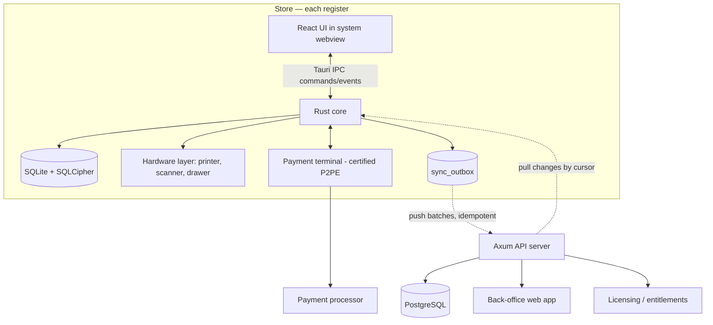

# Cross-Platform POS — Engineering Blueprint

**Decision document, v1.0.** This picks up where the research report left off: it stops comparing options and commits to one stack, one architecture, and one set of engineering standards, optimized for footprint, correctness, and long-term maintainability rather than for reusing any existing skill set.

---

## 0. The decision

| Layer | Choice | Why (one line) |
|---|---|---|
| App shell | **Tauri 2** (Rust) | Windows + macOS + Linux (+ Android/iOS later) from one codebase; single-digit-MB installers and a fraction of Electron's RAM — matters on cheap register hardware |
| UI | **React + TypeScript** (Vite, Tailwind) | Fastest path to a feature-rich, touch-first UI; enormous component/testing ecosystem |
| UI state | Zustand (app state) + TanStack Query (server state) | Simple, predictable, minimal boilerplate |
| Local data | **SQLite via `rusqlite` + SQLCipher** | Encrypted, embedded, battle-tested; owned by the Rust side, not the webview |
| Domain core | **Pure Rust crates** shared by app *and* server | Money, tax, pricing, and sync logic written once, tested once, reused everywhere |
| Hardware | Rust: `serialport`, `rusb`/`hidapi`, raw **ESC/POS** | Direct, reliable device control with no browser sandbox in the way |
| Backend | **Axum + SQLx + PostgreSQL** | Same language as the core; high throughput; boring, reliable, typed SQL |
| Sync | **Custom outbox/changelog protocol** (evaluate PowerSync as accelerator) | Offline-first is the product's heart — own it, or buy a proven engine, never improvise it |
| Back office | React web app (shared design system) | Catalog, pricing, reporting, multi-store admin in the browser |
| Payments | **Semi-integrated certified terminals** (Adyen Terminal API, Stripe Terminal, or regional PSP) | Card data never touches your code → minimal PCI scope |
| CI/CD | GitHub Actions + `tauri-action`, code signing + notarization, Tauri updater | Signed, reproducible, auto-updating releases from day one |
| Observability | Sentry (Rust + JS) + `tracing` | Crash reports and sync-lag metrics from every register in the field |

Two languages total — **Rust** (core, hardware, database, server) and **TypeScript** (UI). Both are worth learning from zero for this product: Rust because a POS is long-running, hardware-touching, money-handling software where memory safety and strong typing pay for themselves daily; TypeScript because no other ecosystem lets you build rich UIs faster.

### Why not the alternatives

**Electron** loses on the one axis you named first — optimization. It ships a full Chromium per install (~10–30× the size, roughly double the RAM) for no functional gain here. **.NET MAUI** has no Linux target, and Linux matters for kiosks and cheap registers. **Qt** is superb but pushes you into C++ and commercial licensing questions for less UI velocity. **Flutter** is the one genuinely competitive alternative — and there is a clean decision rule:

> **If your primary hardware will be Android smart terminals (Sunmi, iMin, PAX and similar all-in-one devices), build in Flutter instead.** Its Android story, touch rendering, and plugin ecosystem for those devices are stronger. **If your primary hardware is desktop registers (Windows/macOS/Linux PCs with USB/serial peripherals), Tauri 2 + Rust is the stronger, leaner choice** — and it still gives you Android/iOS as secondary targets later.

Everything below assumes the Tauri path; ~80% of it (architecture, data model, sync protocol, payments, security) is stack-agnostic and survives a switch to Flutter unchanged.

---

## 1. System architecture

The governing principle is **register autonomy**: *a sale must complete, print, and open the drawer with the network cable physically cut.* The cloud is a coordination and reporting plane, never a runtime dependency.



Reads and writes during a sale hit only the local encrypted SQLite. A background sync task drains the outbox and pulls remote changes whenever connectivity exists. The back office talks only to Postgres through the API; it never talks to registers directly — changes flow down through sync like any other data.

One deliberate consequence: **the server is stateless and boring.** All the interesting invariants (money math, tax, stock arithmetic) live in shared Rust crates that both the register and the server compile in, so the two can never disagree about what a total is.

---

## 2. Repository layout

A single monorepo: one Cargo workspace for Rust, one pnpm workspace for TypeScript.

```
pos/
├─ apps/
│  ├─ terminal/              # the register (Tauri 2)
│  │  ├─ src/                # React UI
│  │  └─ src-tauri/          # Rust shell: IPC commands, db, sync task, hardware wiring
│  ├─ server/                # Axum: sync endpoints, auth, licensing, reporting API
│  └─ backoffice/            # React web admin (catalog, pricing, reports, stores)
├─ crates/
│  ├─ pos-domain/            # PURE logic: Money, tax engine, pricing, cart state machine
│  ├─ pos-db/                # SQLite schema, migrations, repositories
│  ├─ pos-sync/              # protocol types, outbox/cursor logic (client+server)
│  └─ pos-hardware/          # Printer/Scanner/Drawer/Terminal traits + drivers
├─ packages/
│  ├─ ui/                    # shared React components + design tokens
│  └─ api-types/             # TS types generated from the server's OpenAPI schema
└─ .github/workflows/        # test, cross-platform build matrix, sign, release
```

`pos-domain` is the crown jewel and must stay **pure** — no I/O, no SQLite, no Tauri, no network. Just types and functions. That is what makes it trivially testable and shareable between register and server.

---

## 3. Data model

### Non-negotiable principles

1. **Money is integer minor units** (`i64` cents/fils/pence) in every table and every wire format. Floats never touch money. Intermediate math (tax, proration) uses `rust_decimal`, then rounds once, per an explicit, configurable rule (default: banker's rounding, per-line — jurisdictions differ, so it's a setting, not a constant).
2. **Sales are immutable facts.** A completed sale is never updated. Refunds and corrections are *new* documents referencing the original. This single rule eliminates the hardest class of sync conflicts.
3. **Stock is a ledger, not a column.** On-hand quantity = `SUM(stock_movement.qty)`. Sales, receiving, counts, transfers, and shrinkage are all append-only movements. Auditable by construction, and append-only rows merge trivially across offline registers.
4. **Every row**: UUIDv7 primary key (time-ordered, offline-generatable, index-friendly), `created_at`, `updated_at`, `version` (server-assigned change number), `origin_device`.
5. **Soft deletes only** for synced entities (tombstones), so deletions propagate.

### Schema sketch (representative subset)

```sql
-- Catalog (server-authoritative, LWW sync)
CREATE TABLE product (
  id            BLOB PRIMARY KEY,          -- UUIDv7
  sku           TEXT NOT NULL UNIQUE,
  name          TEXT NOT NULL,
  tax_group_id  BLOB NOT NULL REFERENCES tax_group(id),
  price_minor   INTEGER NOT NULL,          -- default price, minor units
  currency      TEXT NOT NULL,             -- ISO 4217
  is_active     INTEGER NOT NULL DEFAULT 1,
  deleted_at    TEXT,                      -- tombstone
  updated_at    TEXT NOT NULL,
  version       INTEGER NOT NULL DEFAULT 0
);
CREATE TABLE product_barcode (product_id BLOB, barcode TEXT UNIQUE, ...);
CREATE TABLE tax_group   (id BLOB PRIMARY KEY, name TEXT, ...);
CREATE TABLE tax_rule    (id BLOB PRIMARY KEY, tax_group_id BLOB, rate_bp INTEGER, -- basis points
                          inclusive INTEGER, valid_from TEXT, valid_to TEXT, region TEXT);
CREATE TABLE price_list  (id BLOB PRIMARY KEY, store_id BLOB, name TEXT, ...);

-- Sales (register-authoritative, append-only, conflict-free)
CREATE TABLE sale (
  id             BLOB PRIMARY KEY,
  receipt_number TEXT NOT NULL,            -- per-register sequence: REG01-000123
  register_id    BLOB NOT NULL,
  shift_id       BLOB NOT NULL,
  cashier_id     BLOB NOT NULL,
  customer_id    BLOB,
  status         TEXT NOT NULL CHECK (status IN ('completed','voided','parked')),
  subtotal_minor INTEGER NOT NULL,
  tax_minor      INTEGER NOT NULL,
  total_minor    INTEGER NOT NULL,
  currency       TEXT NOT NULL,
  ref_sale_id    BLOB,                     -- set on refunds → original sale
  business_date  TEXT NOT NULL,
  completed_at   TEXT NOT NULL
);
CREATE TABLE sale_line   (id BLOB PRIMARY KEY, sale_id BLOB, product_id BLOB,
                          qty INTEGER, unit_price_minor INTEGER, discount_minor INTEGER,
                          tax_minor INTEGER, tax_rate_bp INTEGER, total_minor INTEGER);
CREATE TABLE sale_tender (id BLOB PRIMARY KEY, sale_id BLOB,
                          method TEXT,                -- cash | card | wallet | voucher
                          amount_minor INTEGER,
                          psp_ref TEXT,               -- terminal transaction reference
                          change_minor INTEGER);

-- Inventory ledger (append-only)
CREATE TABLE stock_movement (id BLOB PRIMARY KEY, product_id BLOB, store_id BLOB,
                             qty INTEGER,             -- negative on sale
                             reason TEXT,             -- sale|refund|receive|count|transfer|shrink
                             ref_id BLOB, occurred_at TEXT);

-- Cash & shifts
CREATE TABLE shift         (id BLOB PRIMARY KEY, register_id BLOB, opened_by BLOB,
                            opening_float_minor INTEGER, declared_close_minor INTEGER,
                            counted_close_minor INTEGER, over_short_minor INTEGER,
                            opened_at TEXT, closed_at TEXT);
CREATE TABLE cash_movement (id BLOB PRIMARY KEY, shift_id BLOB, kind TEXT,  -- paid_in|paid_out|drop|float
                            amount_minor INTEGER, reason TEXT, actor_id BLOB, occurred_at TEXT);

-- People & access
CREATE TABLE user      (id BLOB PRIMARY KEY, name TEXT, pin_hash TEXT,      -- Argon2id
                        role_id BLOB, is_active INTEGER);
CREATE TABLE role      (id BLOB PRIMARY KEY, name TEXT);
CREATE TABLE role_perm (role_id BLOB, permission TEXT);                     -- e.g. 'sale.void'
CREATE TABLE customer  (id BLOB PRIMARY KEY, name TEXT, email TEXT, phone TEXT,
                        loyalty_points INTEGER, consent_marketing INTEGER, deleted_at TEXT);

-- Integrity & sync plumbing
CREATE TABLE audit_log   (id BLOB PRIMARY KEY, actor_id BLOB, action TEXT, entity TEXT,
                          entity_id BLOB, detail TEXT, prev_hash BLOB, hash BLOB, at TEXT);
CREATE TABLE sync_outbox (seq INTEGER PRIMARY KEY AUTOINCREMENT, entity TEXT, entity_id BLOB,
                          op TEXT, payload TEXT, created_at TEXT, pushed_at TEXT);
CREATE TABLE sync_cursor (entity TEXT PRIMARY KEY, server_version INTEGER);
```

Notes worth internalizing: receipt numbers are **per-register sequences** (globally unique by prefix) because a central counter cannot exist offline; `business_date` is distinct from wall-clock time so a 00:30 sale can belong to yesterday's trading day; the audit log is **hash-chained** (`hash = H(prev_hash ‖ row)`) so tampering is detectable — a cheap, professional-grade integrity property.

---

## 4. Offline-first sync

This is the component that separates professional POS software from demos. Design it around one insight: **different data has different ownership**, so use different strategies per class instead of one generic conflict resolver.

| Data class | Examples | Authority | Strategy |
|---|---|---|---|
| Facts / documents | sales, tenders, stock & cash movements, audit | Register that created them | **Append-only push.** Immutable, UUID-keyed → no conflicts possible, replays are harmless |
| Reference / catalog | products, prices, taxes, users, roles | Server (back office) | **Pull, last-write-wins by server `version`**, tombstones for deletes |
| Mutable shared state | customer profile, loyalty balance | Server arbitrates | Field-level LWW for profile; **balances as movement ledgers**, never as overwritten totals |

### The protocol

**Push (register → server).** Every local write also appends to `sync_outbox` in the *same SQLite transaction* (the transactional outbox pattern — sale and its outbox entry commit or fail together). A background task drains the outbox in batches: `POST /sync/push { device_id, batch_id, changes[] }`. The server upserts by UUID, making the call **idempotent** — retries after timeouts are safe. Only after a confirmed 200 does the register mark rows `pushed_at`.

**Pull (server → register).** The server keeps a monotonically increasing `version` per row (a global change sequence in Postgres). The register asks `GET /sync/pull?entity=product&after=<cursor>&limit=500`, applies changes, advances `sync_cursor`. Deletes arrive as tombstones. First run bootstraps from a snapshot, then tails the changelog.

**Clocks.** Never order by device wall-clock — registers drift. Ordering comes from server-assigned versions (pull) and UUIDv7 + append-only semantics (push). Record device time for humans, not for logic.

**Operational rules.** Sync failures are *silent to the cashier* and loud to you (metrics + back-office device health: last-seen, outbox depth, sync lag). Payments are **never** blocked on sync. Cap outbox growth alarms at, say, 48h of offline accumulation.

### Build vs. buy

The protocol above is a few thousand lines of Rust and is the classic pattern real POS vendors run. The credible alternative is **PowerSync** — an open-source, production-grade Postgres↔SQLite bidirectional sync engine with first-class offline write queues, explicitly aimed at use cases like retail POS. Trade-off: its client SDKs are JS/Flutter/Kotlin/Swift-centric, so in a Tauri app the synced SQLite would live webview-side rather than in your Rust core. Recommendation: **prototype the custom outbox in week one** (it is small and teaches you the invariants); adopt PowerSync only if multi-entity partial sync across many stores starts eating real engineering time. ElectricSQL is also worth watching but is read-path-first today.

---

## 5. Hardware abstraction layer

Define capability traits in `pos-hardware`; ship drivers behind them. The UI never talks to devices — it invokes Tauri commands, Rust does the work.

```rust
pub trait ReceiptPrinter: Send + Sync {
    fn print(&self, doc: &RenderedReceipt) -> Result<(), HwError>;
    fn open_drawer(&self) -> Result<(), HwError>;   // ESC p pulse via printer port
    fn status(&self) -> PrinterStatus;              // paper-out, cover-open, offline
}
pub trait BarcodeSource { /* subscribe to scan events */ }
pub trait PaymentTerminal {
    fn collect(&self, amount: Money, sale_ref: &str) -> Result<TenderResult, PayError>;
    fn refund(&self, amount: Money, original_ref: &str) -> Result<TenderResult, PayError>;
    fn cancel(&self) -> Result<(), PayError>;
}
```

**Receipt printers.** Speak raw **ESC/POS** — over TCP port 9100 for network printers, `serialport` for RS-232, `rusb`/`hidapi` for USB. Do *not* use webview printing; it is slow and unreliable for receipts. Render receipts from a template (JSON/DSL) to ESC/POS bytes in Rust, and to PDF/HTML with the same template for email receipts. **Persist the rendered bytes with the sale** and run printing through a retry queue — a paper jam must never lose a receipt, and reprint must be exact.

**Cash drawer.** Almost always kicked via the printer's drawer port (`ESC p m t1 t2`). Log every drawer-open event with the actor — including no-sale opens.

**Barcode scanners.** Default mode is a keyboard wedge (HID). Handle it in the UI with a global listener using timing heuristics: a burst of characters faster than human typing, terminated by Enter, is a scan. Also support serial mode for reliability. Critical detail: scans must route correctly even when focus is in a search box.

**Non-obvious professional details:** printer codepage handling for non-Latin scripts (Arabic and others often require rendering the receipt as a raster image instead of text mode); a **hardware simulator** implementation of every trait so the full app runs and tests on a laptop with zero devices attached; a diagnostics screen in the app (test print, drawer kick, scan echo, terminal ping) — support teams live in that screen.

**Line displays, scales, kitchen printers** slot in later behind the same trait pattern.

---

## 6. Payments

The only professional architecture for card-present is **semi-integrated**: a certified P2PE terminal captures and encrypts card data; your app sends *amount + reference* to the terminal and receives back *result + token/reference*. **PAN, track data, and CVV never exist in your process, your database, or your logs.** This collapses PCI DSS scope to one of the short self-assessment questionnaires (e.g., SAQ P2PE) instead of a full audit — confirm the exact SAQ with a QSA before launch, and never claim compliance you haven't validated.

Integration surface, in order of portability: **Adyen Terminal API** (plain JSON over HTTPS to the terminal, cloud or local — trivially callable from Rust, fully stack-agnostic); **Stripe Terminal** (excellent SDKs; the JS SDK for internet-connected readers runs fine in the webview); regional PSPs behind the same `PaymentTerminal` trait. Provider availability, pricing, and terminal certification **vary sharply by country** — verify coverage for your actual target market before writing a line of integration code, and keep the trait boundary clean so swapping PSPs is a driver change, not a rewrite.

Rules that prevent real-world money bugs: store the terminal's transaction reference on every `sale_tender` (reconciliation depends on it); treat "terminal timeout" as *unknown outcome* — query the terminal's last-transaction status before retrying, or you will double-charge; support partial approvals and split tender from day one (bolting them on later deforms the checkout flow); refunds to card go through the PSP's refund API against the original reference, never as a fresh charge.

---

## 7. Security & compliance baseline

- **Local DB encrypted** with SQLCipher; the key lives in the OS credential store (Windows Credential Manager / macOS Keychain / Secret Service) via the `keyring` crate — never in a config file.
- **Cashier auth**: PINs hashed with **Argon2id**; optional badge/QR fast-login; auto-lock on idle; manager-PIN escalation for voids, refunds over threshold, price overrides, drawer opens.
- **RBAC enforced in Rust commands**, not in the UI. Hiding a button is UX; the permission check in the command handler is security.
- **Hash-chained audit log** (§3) covering logins, voids, refunds, price overrides, drawer events, settings changes, and sync anomalies.
- **TLS everywhere**; certificate validation on; consider pinning for the sync API.
- **Signed everything**: Windows Authenticode, macOS notarization, and Tauri's signed update manifests — an unsigned or tampered update must not install.
- **GDPR-grade PII handling** even outside the EU (it is simply the professional standard): collect the minimum, provide export and erasure for customer data (erasure via anonymization — you must keep the financial facts), honor a marketing-consent flag, and document retention periods.
- **Licensing** (per your research doc's model): Ed25519-signed entitlement files, periodic online validation with a **generous offline grace period** (a store must not die because your license server did), and degrade to read-only rather than lock-out on expiry.
- **Secrets hygiene**: no card data, PINs, or tokens in logs; scrub Sentry events; `.env` never committed.

---

## 8. Engineering standards

**Architecture.** Hexagonal: `pos-domain` (pure) → adapters (`pos-db`, `pos-hardware`, sync, Tauri IPC) → shells (terminal app, server). Dependency arrows point inward only.

**The checkout is a state machine**, written explicitly, not implied by UI state:

```
Idle → Building(cart) → Tendering(due, collected[])
     → Finalizing(print, drawer, stock, outbox — atomically)
     → Complete
  Building → Parked → Building        (park/resume)
  Tendering → Building                (add items before payment starts only)
  Any → Voided                        (manager permission, audited)
```

Encode it as a Rust enum with transition functions in `pos-domain`; illegal transitions won't compile into the app. This is the difference between a POS that survives "cashier pulled the power cord mid-payment" and one that doesn't — on restart, the machine resumes from persisted state: an incomplete `Finalizing` re-runs idempotently; an interrupted card `Tendering` triggers the terminal status query from §6.

**Testing pyramid.**
- Unit + **property-based tests** (`proptest`) on `pos-domain`. Properties worth encoding: line taxes sum to receipt tax within the rounding rule; total = subtotal − discounts + tax for *all* inputs; refunds can never exceed the remaining refundable balance; splitting a tender never changes the total.
- **Golden-file tests** for receipts: template + fixture sale → byte-exact ESC/POS output, diffed in CI.
- Sync **contract tests**: server and client both test against the same protocol fixtures; plus a chaos test that replays batches, drops responses, and duplicates pushes — the DB must end identical.
- Integration tests on real SQLite (migrations up + down every CI run).
- UI: Vitest + Testing Library for components; Playwright end-to-end against the web build with the hardware simulator; a small WebDriver smoke suite on the packaged app per OS.
- A **hardware lab checklist** before each release: one real thermal printer, one scanner, one terminal, run the diagnostics screen.

**CI/CD.** GitHub Actions matrix (Windows/macOS/Linux): `cargo clippy -D warnings`, `cargo test`, `pnpm test`, build via `tauri-action`, sign + notarize, publish to the Tauri updater feed with **staged rollout** (5% → 50% → 100%) and one-click rollback. Product rule: **never apply an update while a shift is open** — download in background, install on register close.

**Migrations** are versioned and forward-only in production for both SQLite and Postgres; every schema change ships with a data migration and a test.

**Observability.** Sentry for Rust panics and JS errors; `tracing` with structured fields (`register_id`, `sale_id`); metrics that actually predict support tickets: outbox depth, sync lag, print-failure rate, terminal-timeout rate, crash-free sessions, cold-start time. Surface per-device health in the back office.

**Performance budgets** (enforced, not aspirational): scan → line-on-screen < 100 ms; total recompute < 16 ms; cold start → sellable < 3 s; search-as-you-type over 50k SKUs < 50 ms (SQLite FTS5 handles this easily).

---

## 9. UX standards for a register

Touch-first: minimum ~48 px hit targets, no hover-dependent affordances, an on-screen numpad everywhere a number is entered. Keyboard-first at the same time: every checkout action reachable without touching the screen, because scanning *is* keyboard input. Internationalization from day one — UI strings externalized, **RTL layout support**, locale-aware number/currency formatting, and printer codepage/raster strategy for non-Latin receipts (retrofitting RTL is miserable; scaffolding it is cheap). Always-visible sync/offline indicator that reassures rather than alarms ("Offline — sales are safe and will sync"). A **training mode** flag that watermarks receipts and excludes transactions from reports. Optimistic UI on local data (it's local — there is nothing to wait for).

---

## 10. Build order

| Phase | Scope | Exit criterion |
|---|---|---|
| **0. Foundations** (~wks 1–4) | Monorepo, CI matrix with signing, `pos-domain` (Money, tax engine, cart machine) with property tests, SQLCipher DB + migrations, hardware simulator | A signed installer on all 3 OSes that opens a cart and computes correct totals |
| **1. Sellable MVP** (~wks 5–12) | Checkout UI, barcode scan, cash tender + change, ESC/POS receipts + drawer, product CRUD (local), users/PINs/RBAC, audit log, park/resume | A real store could sell for cash, fully offline, all day |
| **2. Money-grade** (~wks 13–20) | Payment terminal integration, split tender, refunds/voids with escalation, shifts + cash management + X/Z reports, receipt templates, email receipts | Card payments reconcile to the penny against PSP reports |
| **3. Connected** (~wks 21–30) | Axum server + Postgres, outbox/pull sync, back-office catalog & pricing, customers + loyalty ledger, licensing/entitlements | Two registers + back office converge to identical state through offline chaos tests |
| **4. Multi-store & depth** (~wks 31–40) | Store/price-list scoping, inventory receiving/counts/transfers, reporting & dashboards, promotions engine, device-health console | A 3-store pilot runs a full week unattended |
| **5. Hardening & launch** | Load/soak tests, pen test, PCI SAQ with QSA, restore drills (3-2-1 backups), docs + onboarding wizard, staged-rollout updater proven, optional store listings | Pilot merchants + a signed compliance story |

Phases 1–2 deliberately front-load the unforgiving parts — hardware, money, offline — because they dictate the architecture; dashboards never do.

---

## 11. Learning path (ground-up, in order)

1. **Rust**: *The Rust Programming Language* (the Book) + Rustlings; then read real code in `rusqlite`, `axum` examples. Target: comfortable with ownership, `Result`, traits, and `tokio` basics. (~3–5 wks of evenings; start Phase 0 before you feel "done" — the project teaches the rest.)
2. **SQL/SQLite**: schema design, transactions, indexes, FTS5, `EXPLAIN QUERY PLAN`.
3. **Tauri 2**: official docs — commands, events, capabilities/permissions, plugins, updater, `tauri-action`.
4. **TypeScript + React**: the official React docs (they are genuinely good now), then TanStack Query and Zustand docs.
5. **Axum + SQLx**: build the sync endpoints as your learning project.
6. **Domain reading**: Martin Fowler's *Money* pattern; PCI SSC's merchant/P2PE guides; the "local-first software" essay (Ink & Switch) and PowerSync/ElectricSQL architecture docs for sync thinking; your PSP's terminal-integration docs.

The sequencing matters less than one habit: **every learning exercise should be a commit to this repo.** Phase 0 *is* the curriculum.

---

## Appendix: decisions someone will eventually question

*Why SQLite and not Postgres on the register?* Zero-admin, embedded, survives power loss (WAL mode), encrypted with SQLCipher, and more than fast enough for any single register. Postgres belongs on the server. *Why UUIDv7 over v4?* Time-ordered keys keep B-tree inserts append-ish and make IDs sortable for debugging, while remaining offline-generatable. *Why not CRDTs everywhere?* Because the data model (§4) makes 90% of writes append-only facts that cannot conflict; CRDT machinery would be complexity without benefit. *Why raw ESC/POS instead of OS print drivers?* Determinism and speed — drivers add spooler latency and per-OS quirks; raw bytes are identical on every platform. *Why two languages instead of one?* Rust alone makes rich UI slow to build; TS alone can't own hardware, crypto, and an encrypted DB cleanly. The boundary (Tauri IPC) is narrow and typed.
